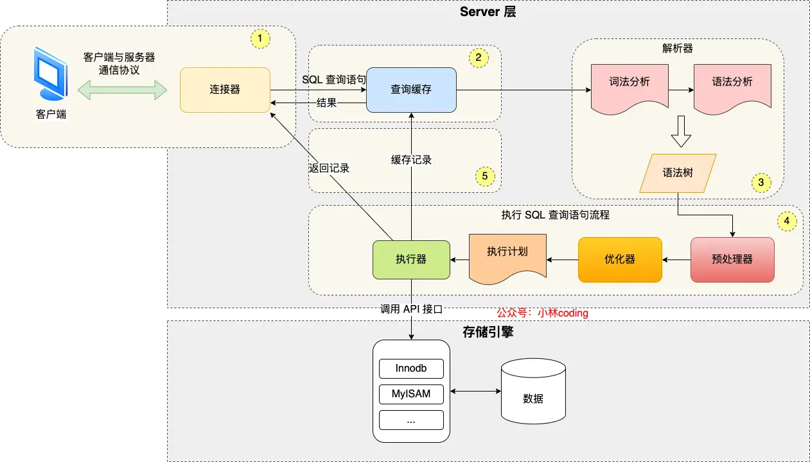

```
select * from users where id = 1;
```

# MySQL 架构
> MySQL 架构分为两层：Server 层、存储引擎层

Server 层：负责建立连接、分析和执行 SQL
- 连接器、查询缓存、解析器、预处理器、优化器、执行器等
- 内置函数（如日期、时间、数学、加密函数等）
- 跨存储引擎功能（如存储过程、触发器、视图等）

存储引擎层：负责存储和读取数据
- 支持 InnoDB（MySQL 5.5版本后默认）、MyISAM、Memory 等多个存储引擎
- 不同存储引擎共用一个 Server 层
- 不同存储引擎支持的索引结构不同，InnoDB 默认使用 B+树索引

## 连接器
- Linux 基于 TCP 协议连接 MySQL 服务器

```
mysql -h$ip -u$user -p$password
```

## 查询缓存
- 如果为查询语句，先会查询查询缓存
- 查询缓存以 key-value 对形式存储在内存，key 为查询语句，value 为查询结果
- 每次更新数据表，都会清除缓存（MySQL 8.0 后已删除）

## 解析 SQL
### 解析器
- 词法分析：识别关键字
- 语法分析：检查语法、构建语法树

## 执行 SQL
### 预处理器
- 检查表、字段是否存在
- 将 * 扩展为表的所有字段
### 优化器
- 制定执行计划
```
  // explain 命令查看执行计划(索引类型)
  explain select * from users where id = 1;
```
### 执行器
- 执行执行计划
> read_first_record 指针指向存储引擎对应的接口，循环判断是否符合条件，若符合则返回记录，下一次循环从 read_record 指针开始