# 数据存储

存储目录：/var/lib/mysql/数据库名  
存储文件：

```
[root@cozyxiong ~]#ls /var/lib/mysql/test_database
db.opt
users.frm
users.ibd
```

db.opt：保存数据库的配置信息，如数据库的默认字符集和字符校验规则  
users.frm：保存 users 表的表结构信息  
users.ibd：保存 users 表的表数据信息(独占表空间文件)

# 表空间文件结构
表空间由段、区、页、行组成。
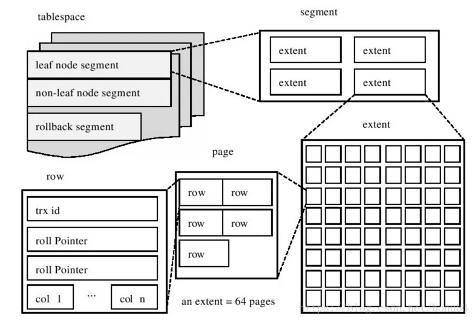
## 段(Segment)
> 表空间是由各个段组成，段是由多个区组成。

分类  
索引段：存放 B+ 树非叶子节点的区的集合  
数据段：存放 B+ 树叶子节点的区的集合  
回滚段：存放 Undo 页面链表的区的集合  

## 区(Extent)
> InnoDB存储引擎采用B+树的数据结构，B+树每一层的页都通过双向链表连接，方便范围查询，且把链表相邻的页划为同一个区，使其物理位置也相邻，这样磁盘I/O为顺序I/O，范围查询(扫描叶子节点)性能就会很高。  

大小：1MB(包含连续的 64 页)

## 页(Page)
> 记录按行来存储，但数据库按页来读取，这样一次磁盘I/O就可以读取1页的记录。

大小：16KB(包含 16KB 的记录)

## 行(Row)
> 记录按行来存储，不同的行格式，有不同的存储结构

### 行格式
#### 类型
InnoDB 提供了四种行格式：
- Redundant(非紧凑，很少用)
- Compact(紧凑，MySQL 5.1后默认)
- Dynamic(紧凑，MySQL 5.7后默认)
- Compressed(紧凑)

#### Compact行格式
一条完整的记录分为`记录的额外信息`和`记录的真实数据`两个部分：
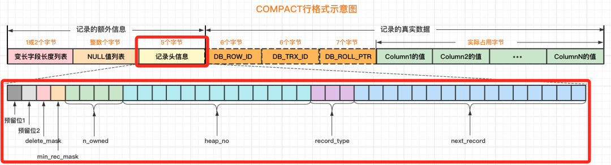

**记录的额外信息**

记录的额外信息包含`变长字段长度列表`、`NULL值列表`、`记录头信息`三个部分。

**变长字段长度列表**

> VARCHAR , BLOB 和 TEXT 类型是变长类型，存储的数据的长度不固定，所以在存储数据的同时，也要把数据的长度存储到变长字段长度列表中，这样在读取数据时才能根据变长字段长度列表去读对应长度的数据。

|  id  |   name    | phone | age  |
|:----:|:---------:|:-----:|:----:|
|  1   | cozyxiong | null  | null |

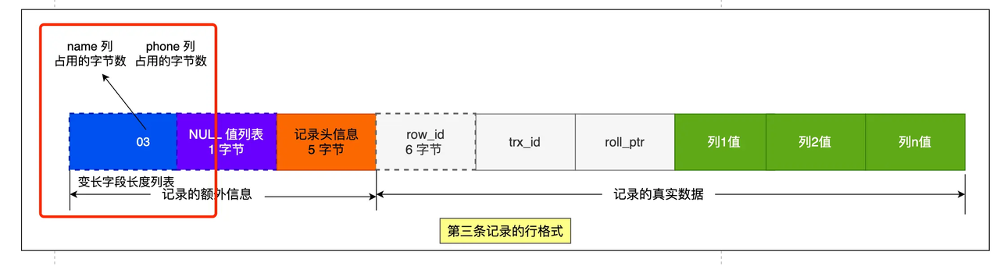
- 表示
    - 十六进制(占用 3 字节，十六进制为 0x03，即 03）
    - 逆序存放(使得位置靠前的记录的真实数据和数据对应的字段长度信息可以同时在一个 CPU Cache Line 中，这样就可以提高 CPU Cache 的命中率)
- 非必须(无变长字段时）
- 1 字节(变长字段允许存储的最大字节数小于等于 255 字节) (255的十六进制为FF)
- 2 字节(变长字段允许存储的最大字节数大于 255 字节)

**NULL 值列表**
> 将NULL值存储到真实数据中浪费空间，因此以整数字节的二进制位存储到NULL列表。

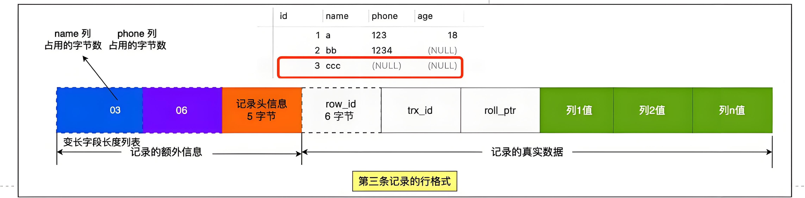

- 表示
    - 二进制(=1 该列值为 NULL，=0 该列值不为 NULL)
    - 逆向排序(name/phone/age(0/1/1),即 age/phone/name(1/1/0))
    - 整数字节(1 个字节 8 位，不满 8 位补全，即 00000110)
    - 十六进制(0x06，即 06)
- 非必须(字段都定义成 NOT NULL)
- 1 字节的倍数

**记录头信息**

记录头信息中包含的内容很多，几个比较重要的：
- delete_mask ：标识此条数据是否被删除。从这里可以知道，我们执行 detele 删除记录的时候，并不会真正的删除记录，只是将这个记录的 delete_mask 标记为 1。
-  next_record：下一条记录的位置。从这里可以知道，记录与记录之间是通过链表组织的，指向的是下一条记录的「记录头信息」和「真实数据」之间的位置，这样的好处是向左读就是记录头信息，向右读就是真实数据，比较方便。
- record_type：表示当前记录的类型，0 表示普通记录，1 表示 B+ 树非叶子节点记录，2 表示最小记录，3 表示最大记录。

**记录的真实数据**

记录的真实数据包含自定义字段的值和隐藏字段：row_id、trx_id、roll_pointer

**row_id**
- 用来唯一标识每条记录
- 非必须(指定了主键或唯一约束列)
- 6 字节
**trx_id**
- 创建/修改/删除该记录的事务的事务 ID
- 必须
- 6 字节
**roll_pointer**
- 指向上一版本(将 undo log 中该记录的不同版本串联起来，称作版本链)
- 必须
- 7 字节

### varchar(n)中n的最大取值
- MySQL 规定除了 TEXT、BLOBs 这种大对象类型之外，其他所有的列(不包括隐藏列和记录头信息)占用的字节长度加起来不能超过 65535 个字节(十六进制 FFFF)
- varchar(n) 中 n 代表的是最多存储的字符数量，而不是字节大小(例如 ASCII 字符集，1 个字符占用 1 个字节）
#### 单字段
假设数据库表中只有一个 varchar(n) 类型的字段且字符集为 ASCII：  
最大长度值列表 + NULL 值列表 + 真实数据 <= 65535
- 最大长度值列表( 2 字节)( n>255 字节)
- NULL 值列表( 1 字节)(只有 1 个字段)
- 真实数据( <=65532 字节)
因此在单字段情况下：max(n) = 65532( ASCII 字符集)
#### 多字段
所有最大长度值列表 + 所有 NULL 值列表 + 真实数据 <= 65535

#### 行溢出
一页 16KB(16384字节)，一条 varchar(n) 类型记录最大可以存储 65532 字节，而 TEXT、BLOB 等大对象还可以存储更大的数据，这时一页可能就存不了一条记录，就会发生`行溢出`，`数据页`中溢出的数据就会存储到另外的`溢出页`中。

**Compact 行格式在发生行溢出后的处理：**

当发生行溢出时，在记录的真实数据处只会保存该列的一部分数据，而把剩余的数据放在「溢出页」中，然后真实数据处用 20 字节存储指向溢出页的地址，从而可以找到剩余数据所在的页。
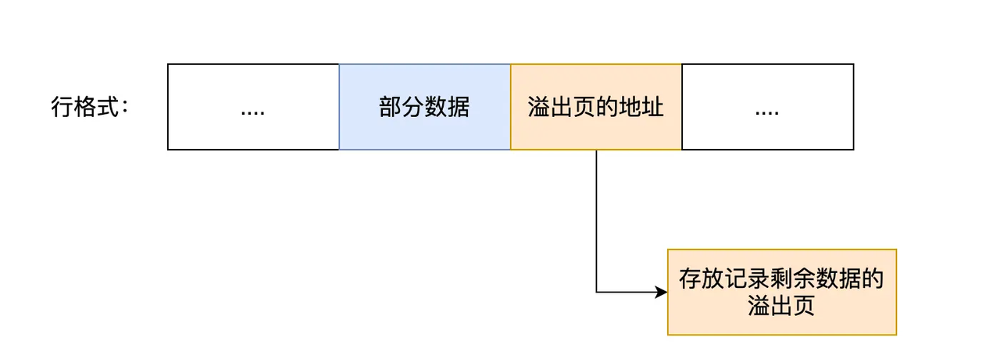

**Dynamic 和 Compressed 行格式在发生行溢出后的处理：**

这两种格式采用完全的行溢出方式，记录的真实数据处不会存储该列的一部分数据，只存储 20 个字节的指针来指向溢出页，而实际的数据都存储在一个或多个溢出页中。
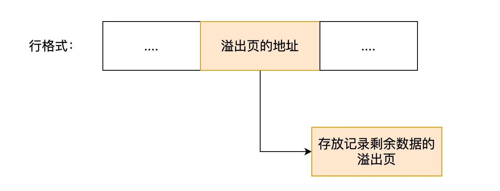

## 页格式
### 类型
- 数据页(存储记录，这些记录按照指定的行格式进行存储)
- Undo 页(存储 undo log 日志信息)
- 系统页(存储系统级别信息)
- Blob 页(存储二进制大对象数据)

### 数据页格式
数据页包括七部分：
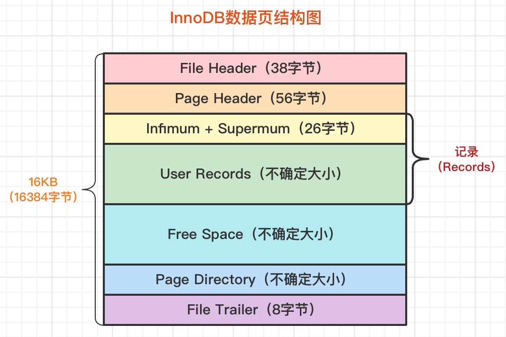
- 文件头：表示页的通用信息
- 页头：表示数据页的专有信息
- 最小和最大记录：表示页的最小和最大记录(虚拟的伪记录)
- 用户记录：存储行记录的内容
- 空闲空间：页中还没被使用的空间
- 页目录：存储记录的相对位置
- 文件尾：校验页是否完整

数据页的 File Header 中有两个指针，分别指向上一个数据页和下一个数据页，连接起来的页相当于一个  <span style="background-color: yellow;">双向链表</span>，使数据页逻辑上相邻。
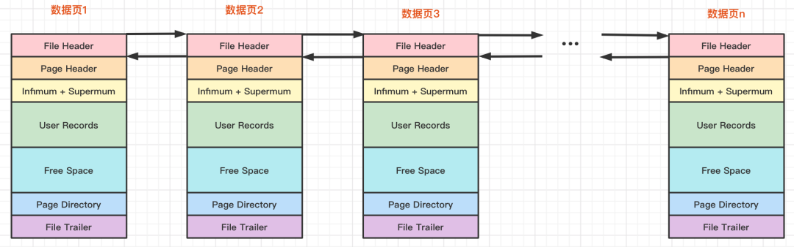
数据页中的记录按照「主键」顺序组成  <span style="background-color: yellow;">单向链表</span>。
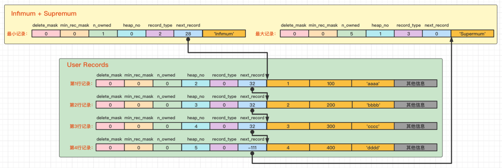
单向链表的特点就是插入、删除方便，但是检索效率不高， 因此，数据页中有一个  <span style="background-color: yellow;">页目录</span>，起到记录的索引作用。
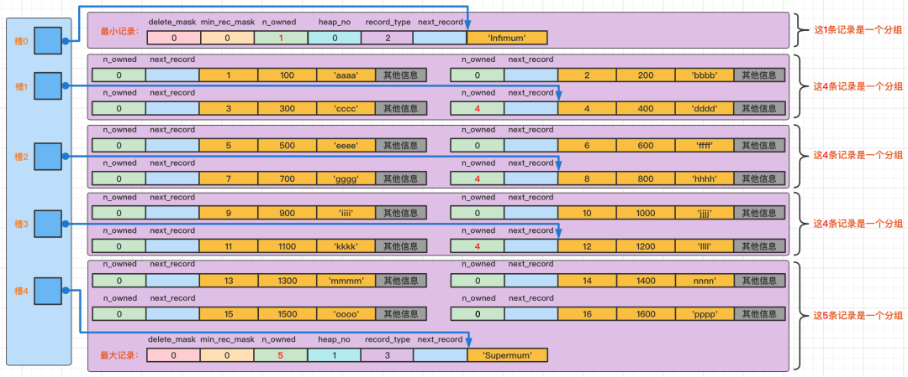

# 记录检索
※ 所以在一个数据页中查找指定主键值的记录的过程分为两步：  
1. 通过  <span style="background-color: yellow;">二分法</span>确定该记录所在的槽，并找到该槽所在分组中主键值最小的那条记录。  
2. 通过记录的 next_record 属性遍历该槽所在的组中的各个记录。

# 数据页检索
核心都是通过主键来查找记录，所以通过主键先找数据页，再找记录。  
在一个数据页中，记录局部有序，通过主键比对页目录找到了记录。  
那么在一堆数据页中，页局部有序(记录整体有序)，才能通过主键比对"数据页的目录"找到含有该主键的数据页，再在该数据页中找记录。  
1. 记录整体有序。
   通过记录移动的操作来始终保证：下一个数据页中用户记录的主键值必须大于上一个页中用户记录的主键值，这个过程称为页分裂。这样就使得整条双向链表的记录都整体有序。
2. 数据页的目录。
   由于数据页编号不一定连续，所以这个目录不仅要有记录的主键还要有对应的页号，这个目录就称为索引。

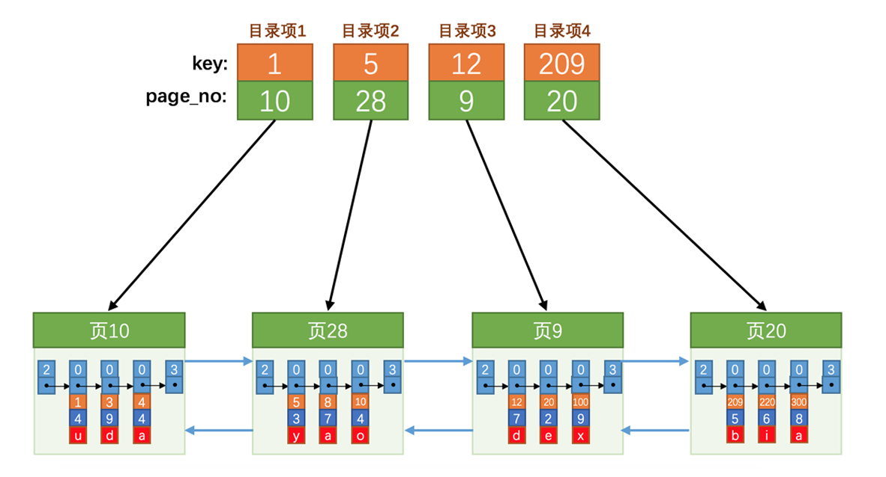
而索引的主键和页号也可以看作页中的用户记录，用参数record_type来作区分。  
(0 普通的用户记录、1 目录项记录、2 最小记录 、3 最大记录)
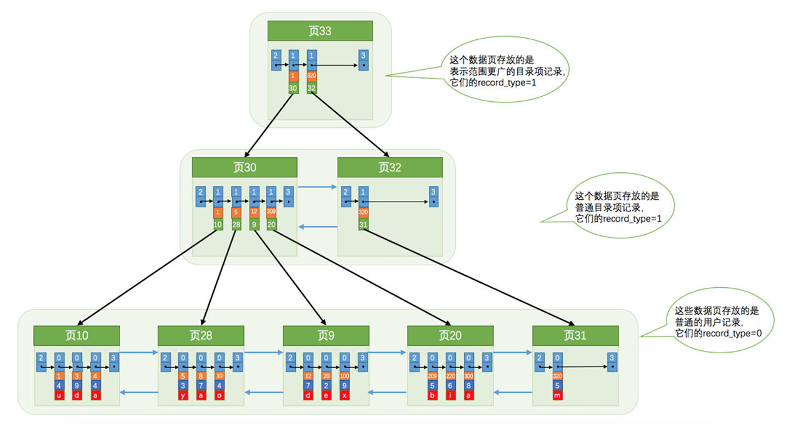
这个数据结构，就称为 B+ 树，B+ 树本身就是索引，可以使用二分查找来找数据页。

这种用主键查找记录的索引，称为`聚簇索引`，而如果用其它字段查找记录，则分为两步：先用其它字段查找主键+再用主键查找记录，而用其它字段查找主键的索引，称为`二级索引`，查找完主键再通过聚簇索引查找记录的过程，称为`回表`。如果查找的不是记录，而是主键，则只需要二级索引就可以找到，不需要回表，这个过程就称为`索引覆盖`。

**聚簇索引：**
- 如果有主键，默认会使用主键作为聚簇索引的索引键（key）；
- 如果没有主键，就选择第一个不包含 NULL 值的唯一列作为聚簇索引的索引键（key）；
- 在上面两个都没有的情况下，InnoDB 将自动生成一个隐式自增 id 列作为聚簇索引的索引键（key）；
  其它索引都属于辅助索引（Secondary Index），也被称为二级索引或非聚簇索引。
  创建的主键索引和二级索引默认使用的是 B+Tree 索引。

**聚簇索引和二级索引的区别：**
- 聚簇索引(非叶子节点存放主键+页号，叶子节点存放完整的用户数据)
  - 二级索引(非叶子节点存放该字段+页号，叶子节点存放该字段+主键)

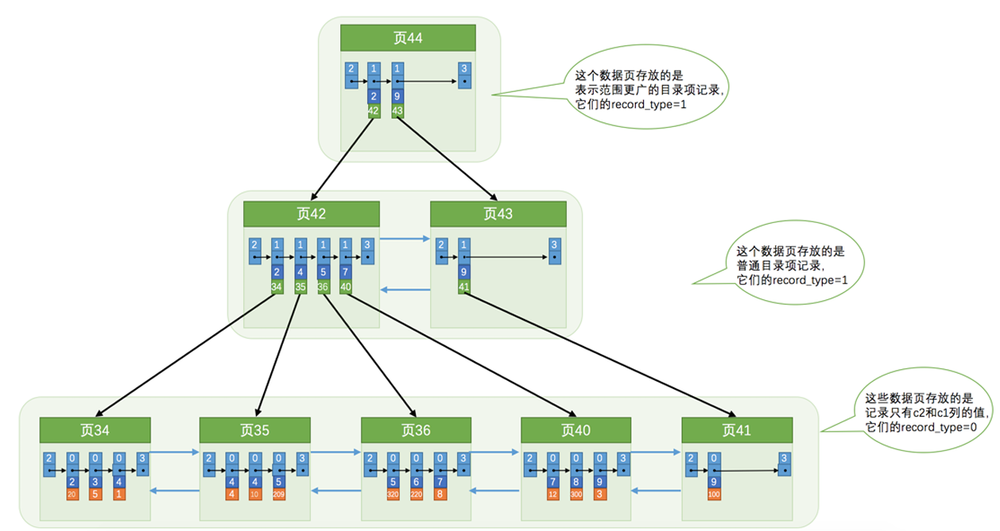

当然，这个其它字段也可以是多个，即同时为多个字段建立索引，也就是先为一个字段排序，这个字段相同时，再按另一个字段排序，这样的索引，称为`联合索引`。
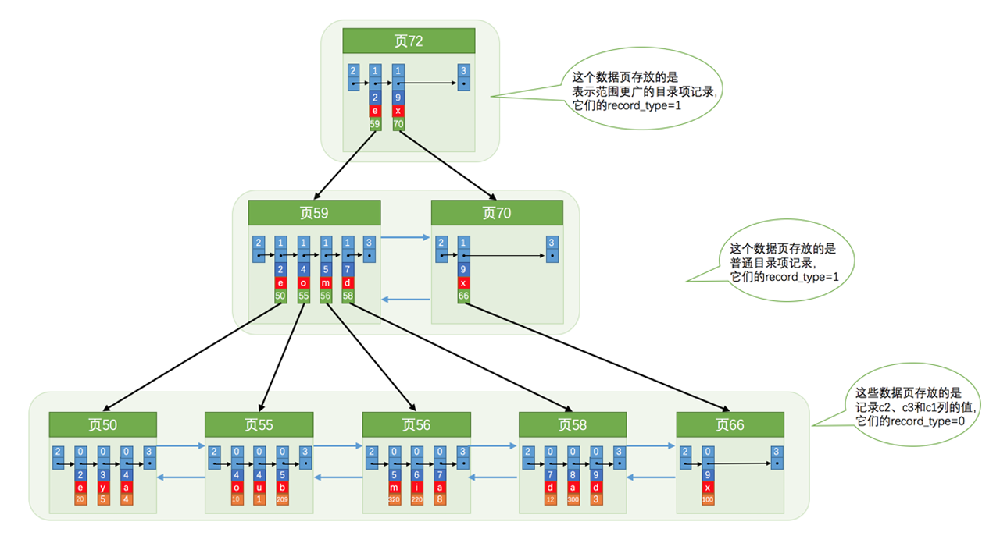


# 总结
使用记录主键值的大小进行记录和页的排序：
- 页内的记录是按照主键的大小顺序排成一个单向链表。
- 各个存放用户记录的页也是根据页中用户记录的主键大小顺序排成一个双向链表。
- 存放目录项记录的页分为不同的层次，在同一层次中的页也是根据页中目录项记录的主键大小顺序排成 一个双向链表。

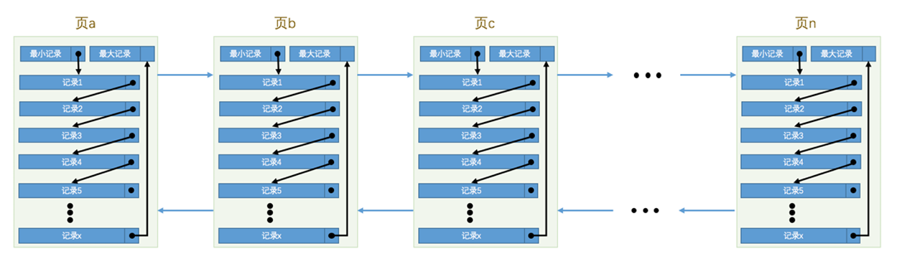
