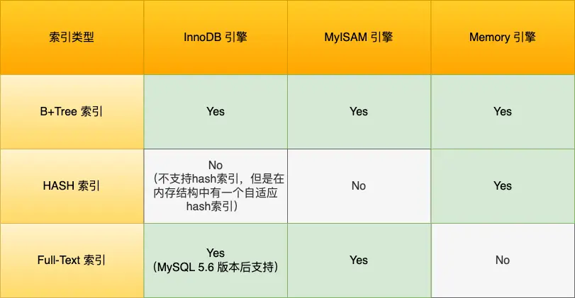
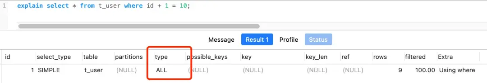
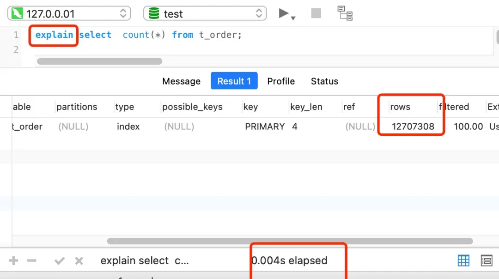

# 索引
> 索引是数据页的目录

索引可以按数据结构、物理存储、字段特性和字段个数进行分类。
- 数据结构
    - B+Tree 索引
    - HASH 索引
    - Full-Text 索引
- 物理存储
    - 聚簇索引(主键索引)
    - 二级索引(辅助索引)
- 字段特性
    - 主键索引
    - 唯一索引
    - 普通索引
    - 前缀索引
- 字段个数
    - 单列索引
    - 联合索引

## 按数据结构分类
不同的存储引擎支持的索引类型不同：

MySQL 5.5 后 InnoDB 为默认存储引擎，B+Tree 索引也是 InnoDB 存储引擎使用最多的索引类型。

### B+Tree索引
**那为什么会选择 B+Tree 作为索引呢？**

由于数据库的索引是保存到磁盘上的，因此当我们通过索引查找某行数据的时候，就需要先从磁盘读取索引到内存，再通过索引从磁盘中找到某行数据，然后读入到内存，也就是说查询过程中会发生多次磁盘 I/O，而磁盘 I/O 次数越多，所消耗的时间也就越大。
另外，MySQL 是支持范围查找的，所以索引的数据结构不仅要能高效地查询某一记录，也要高效地执行范围查找。

所以，要设计一个适合 MySQL 索引的数据结构，至少满足以下要求：
- 高效地查询某一个记录
- 能在尽可能少的磁盘的 I/O 操作中完成查询工作
- 高效地执行范围查找

**二分查找——高效地查询某一个记录**

> 二分查找可以将查找的时间复杂度从O(n)降到O(logn)，条件是数据按顺序排列。
1. 有序数组
- 优点：可以二分查找
- 缺点：插入性能低

2. 二分搜索树
- 优点：可以二分查找、插入性能高
- 缺点：可能退化成链表 O(n)

3. 自平衡二叉搜索树(AVL 树、红黑树)
- 优点：可以二分查找、插入性能高、不会退化成链表 O(n)
- 缺点：随着插入元素增多，树的高度变高，磁盘 I/O 次数变多

4. B 树
- 优点：可以二分查找、插入性能高、不会退化成链表 O(n)、树低磁盘 I/O 次数少
- 缺点：
    1. 每个节点都包含数据(索引 + 记录)，同一数据块容纳节点数少，增加了 I/O 次数
    2. 叶子节点范围查询需要中序遍历多个层级搜索，范围查询效率低

5. B+ 树
- 优点：
    1. 可以二分查找、插入性能高、不会退化成链表 O(n)、树低磁盘 I/O 次数少
    2. 非叶子节点只存放索引，叶子节点才存放全部数据，降低磁盘 I/O 次数
    3. 叶子节点通过双向链表连接，范围查询效率高
    4. 每次查询到在叶子节点中查找数据，查询效率较稳定

6. HASH
- 优点：等值查询 O(1)
- 缺点：不支持范围查询、不支持排序
  在 MySQL 中，支持 hash 索引的是 Memory 引擎，而 InnoDB 中具有自适应 hash 功能(利用方法将 b+ 树索引转化为 hash 索引)，hash 索引是存储引擎根据 B+Tree 索引在指定条件下自动构建的。

## 按物理存储分类
> 从物理存储的角度来看，索引分为聚簇索引（主键索引）、二级索引（辅助索引）。

用主键查找记录的索引，称为`聚簇索引`，而如果用其它字段查找记录，则分为两步：先用其它字段查找主键+再用主键查找记录，而用其它字段查找主键的索引，称为二级索引，查找完主键再通过聚簇索引查找记录的过程，称为`回表`。如果查找的不是记录，而是主键，则只需要二级索引就可以找到，不需要回表，这个过程就称为`索引覆盖`。

### 聚簇索引：
- 如果有主键，默认会使用主键作为聚簇索引的索引键（key）；
- 如果没有主键，就选择第一个不包含 NULL 值的唯一列作为聚簇索引的索引键（key）；
- 在上面两个都没有的情况下，InnoDB 将自动生成一个隐式自增 id 列作为聚簇索引的索引键（key）；

其它索引都属于辅助索引（Secondary Index），也被称为二级索引或非聚簇索引。  
创建的主键索引和二级索引默认使用的是 B+Tree 索引。

**聚簇索引和二级索引的区别：**
- 聚簇索引(非叶子节点存放主键+页号，叶子节点存放完整的用户数据)
- 二级索引(非叶子节点存放该字段+页号，叶子节点存放该字段+主键)

## 按字段特性分类
从字段特性的角度来看，索引分为主键索引、唯一索引、普通索引、前缀索引。

### 主键索引
主键索引就是建立在主键字段上的索引，通常在创建表的时候一起创建，一张表最多只有一个主键索引，索引列的值不允许有空值。  
```
-- 创建表时，创建主键索引：
CREATE TABLE table_name ( .... PRIMARY KEY (index_column_1) USING BTREE );
```
### 唯一索引
唯一索引建立在 UNIQUE 字段上的索引，一张表可以有多个唯一索引，索引列的值必须唯一，但是允许有空值。
```
-- 创建表时，创建唯一索引：
CREATE TABLE table_name ( .... UNIQUE KEY(index_column_1,index_column_2,...) );

-- 建表后，创建唯一索引：
CREATE UNIQUE INDEX index_name ON table_name(index_column_1,index_column_2,...);
```
### 普通索引
普通索引就是建立在普通字段上的索引，既不要求字段为主键，也不要求字段为 UNIQUE。
```
-- 创建表时，创建普通索引：
CREATE TABLE table_name ( .... INDEX(index_column_1,index_column_2,...) );

--  建表后，创建普通索引:
CREATE INDEX index_name ON table_name(index_column_1,index_column_2,...);
```
### 前缀索引
前缀索引是指对字符类型字段的前几个字符建立的索引，而不是在整个字段上建立的索引，前缀索引可以建立在字段类型为 char、 varchar、binary、varbinary 的列上。 使用前缀索引的目的是为了减少索引占用的存储空间，提升查询效率。
```
-- 创建表时，创建前缀索引：
CREATE TABLE table_name( column_list, INDEX(column_name(length)) );

-- 建表后，创建前缀索引：
CREATE INDEX index_name ON table_name(column_name(length));
```
## 按字段个数分类
> 从字段个数的角度来看，索引分为单列索引、联合索引（复合索引）。
### 联合索引
二级索引的其它字段也可以是多个，即同时为多个字段建立索引，也就是先为一个字段排序，这个字段相同时，再按另一个字段排序，这样的索引，称为联合索引。
```
-- 创建表时，创建联合索引：
CREATE TABLE table_name ( .... INDEX(index_column_1,index_column_2,...) );

--  建表后，创建联合索引:
CREATE INDEX index_name ON table_name(index_column_1,index_column_2,...);
```
因为联合索引排序有先后顺序，所以必须满足`最左匹配原则`，否则索引失效。

### 联合索引失效
比如，如果创建了一个 (a, b, c) 联合索引，如果查询条件是以下这几种，就可以匹配上联合索引：
- where a=1；
- where a=1 and b=2 and c=3；
- where a=1 and b=2；

需要注意的是，因为有查询优化器，所以 a 字段在 where 子句的顺序并不重要。  
但是，如果查询条件是以下这几种，因为不符合最左匹配原则，所以就无法匹配上联合索引，联合索引就会失效:
- where b=2；
-  where c=3；
- where b=2 and c=3；

上面这些查询条件之所以会失效，是因为 (a, b, c) 联合索引，是先按 a 排序，在 a 相同的情况再按 b 排序，在 b 相同的情况再按 c 排序。所以，b 和 c 是全局无序，局部相对有序的，这样在没有遵循最左匹配原则的情况下，是无法利用到索引的。

### 联合索引范围查询
联合索引的最左匹配原则会一直向右匹配直到遇到「范围查询」就会停止匹配。也就是范围查询的字段可以用到联合索引，但是在范围查询字段的后面的字段无法用到联合索引。

**Q1: select * from t_table where a > 1 and b = 2，联合索引（a, b）哪一个字段用到了联合索引的 B+Tree？**

答案：a 字段  
区间：(1,+∞)  
分析：联合索引是先按照a字段排序的，搜索a>1的条件时a用到了联合索引，但是在符合a>1条件的联合索引范围内，b字段是无序的，所以b字段没有用到联合索引。

**Q2: select * from t_table where a >= 1 and b = 2，联合索引（a, b）哪一个字段用到了联合索引的 B+Tree？**

A2：a、b 字段  
区间：[1,+∞)  
分析：联合索引是先按照a字段排序的，搜索a>=1的条件时a用到了联合索引，在符合a>1条件的联合索引范围内，b字段是无序的，b字段没有用到联合索引，但是在符合a=1条件的联合索引范围内，b字段是有序的，所以b字段用到了联合索引。

**Q3: SELECT * FROM t_table WHERE a BETWEEN 2 AND 8 AND b = 2，联合索引（a, b）哪一个字段用到了联合索引的 B+Tree？**

A3：a、b 字段  
区间：[2,8]  
分析：不同的数据库对 BETWEEN ... AND 处理方式是有差异的。在 MySQL 中，BETWEEN 包含了 value1 和 value2 边界值，类似于 >= and =<。

**Q4: SELECT * FROM t_user WHERE name like 'j%' and age = 22，联合索引（name, age）哪一个字段用到了联合索引的 B+Tree？**

A4：a、b 字段  
区间：['j','k')

### 索引下推
现在我们知道，对于联合索引（a, b），在执行 select * from table where a > 1 and b = 2 语句的时候，只有 a 字段能用到索引，那在联合索引的 B+Tree 找到第一个满足条件的主键值（ID 为 2）后，还需要判断其他条件是否满足（看 b 是否等于 2），那是在联合索引里判断？还是回主键索引去判断呢？
- 在 MySQL 5.6 之前，只能从 ID2 （主键值）开始一个个回表，到「主键索引」上找出数据行，再对比 b 字段值。
- 而 MySQL 5.6 引入的索引下推优化（index condition pushdown)， 可以在联合索引遍历过程中，对联合索引中包含的字段先做判断，直接过滤掉不满足条件的记录，减少回表次数。 

当你的查询语句的执行计划里，出现了 Extra 为 Using index condition，那么说明使用了索引下推的优化。

### 索引区分度
另外，建立联合索引时的字段顺序，对索引效率也有很大影响。越靠前的字段被用于索引过滤的概率越高，实际开发工作中建立联合索引时，要把区分度大的字段排在前面，这样区分度大的字段越有可能被更多的 SQL 使用到。

区分度就是某个字段 column 不同值的个数「除以」表的总行数，计算公式如下：

比如，性别的区分度就很小，不适合建立索引或不适合排在联合索引列的靠前的位置，而 UUID 这类字段就比较适合做索引或排在联合索引列的靠前的位置。

因为如果索引的区分度很小，假设字段的值分布均匀，那么无论搜索哪个值都可能得到一半的数据。在这些情况下，还不如不要索引，因为 MySQL 还有一个查询优化器，查询优化器发现某个值出现在表的数据行中的百分比（惯用的百分比界线是"30%"）很高的时候，它一般会忽略索引，进行全表扫描。

### 联合索引进行排序
这里出一个题目，针对下面这条 SQL，你怎么通过索引来提高查询效率呢？
```
select * from order where status = 1 order by create_time asc
```
有的同学会认为，单独给 status 建立一个索引就可以了。

但是更好的方式给 status 和 create_time 列建立一个联合索引，因为这样可以避免 MySQL 数据库发生文件排序。

因为在查询时，如果只用到 status 的索引，但是这条语句还要对 create_time 排序，这时就要用文件排序 filesort，也就是在 SQL 执行计划中，Extra 列会出现 Using filesort。

所以，要利用索引的有序性，在 status 和 create_time 列建立联合索引，这样根据 status 筛选后的数据就是按照 create_time 排好序的，避免在文件排序，提高了查询效率。

## 索引失效
本质是你查的字段在 B+ 树中不是全局有序的，或完全无序
1. 仅局部有序
- 左或左右模糊查询
- 联合索引顺序不对
2. 完全无序
- 对索引列使用函数
- 对索引列进行计算
- 对索引列隐式转换( MySQL 自动把字符串转换为数字，当索引列是字符串)
3. 索引不足
- WHERE子句有条件列不是索引列

索引失效，优化器就需要全扫描，一般会全表扫描( type = all )，但如果只查询主键+二级索引，那么选择全扫描索引树，即全索引扫描( type = index )，且索引树为二级索引树，使用覆盖索引，这样查询效率更高。

**`LIKE`模糊匹配**

使用`LIKE`进行模糊匹配查询时，特别是带有通配符（如`%`或`_`）的查询，可能会导致性能问题，因为这些操作通常不能有效利用索引，尤其是在通配符位于模式的开头时。为了使查询时间可控，可以考虑以下策略：
1. 索引优化
- 前缀索引：如果查询模式通常是固定的前缀加上通配符（例如，`LIKE 'prefix%'`），那么可以在该列上创建一个前缀索引。前缀索引只包含列值的前几个字符，这可以减少索引的大小，同时仍然允许有效的查找。
- 全文索引：对于文本字段的模糊搜索，可以考虑使用全文索引（Full-text Index）。全文索引专为处理大量文本数据而设计，支持更复杂的搜索模式，并且通常比`LIKE`更高效。
2. 使用其他技术代替`LIKE`
- 正则表达式：某些数据库系统支持正则表达式的模式匹配，它们可能比 LIKE 更灵活和高效。
- 全文搜索引擎：对于复杂或大量的文本搜索需求，可以集成专门的全文搜索引擎，如 Elasticsearch、Apache Solr 等。这些工具提供了强大的搜索功能和高效的查询性能。
3. 数据库内部优化
- SARGable 查询：尽量构造能够被数据库优化器识别并有效地利用索引的查询条件（即 Search ARGument Able ）。例如，避免在要索引的列上应用函数或操作，这样可以确保查询保持可搜索性。
- 覆盖索引：创建覆盖索引，使得查询所需的所有列都在索引中，从而避免回表操作，提高查询效率。
4. 应用层优化
- 缓存机制：实现应用级别的缓存来存储频繁查询的结果，减少对数据库的压力。
- 分页查询：对于返回大量结果的查询，可以通过分页的方式逐步获取数据，而不是一次性加载所有结果。
- 预过滤：在应用层对用户输入做初步筛选或限制，减少不必要的模糊匹配范围。
5. 其他技巧
- 限制返回行数：使用 LIMIT 子句限制返回的最大行数，特别是在展示搜索结果页面时，这可以显著加快响应时间。
- 选择合适的通配符位置：如果必须使用`LIKE`，尽量将通配符放在模式的末尾，例如`LIKE 'pattern%'`，而不是在开头，因为前者可以更好地利用索引。

## 索引场景
**索引优点**
- 提高查询速度

**索引缺点**
- 需要占用物理空间，数量越大，占用空间越大
- 创建索引和维护索引要耗费时间，这种时间随着数据量的增加而增大
- 会降低表的增删改的效率，因为每次增删改索引，B+ 树为了维护索引有序性，都需要进行动态维护

**索引适用场景**
- 字段有唯一性限制的，比如商品编码
- 经常用于 WHERE 查询条件的字段，这样能够提高整个表的查询速度，如果查询条件不是一个字段，可以建立联合索引
- 经常用于 GROUP BY 和 ORDER BY 的字段，这样在查询的时候就不需要再去做一次排序了，因为建立索引之后在 B+Tree 中的记录都是排序好的

**不需要索引**
- WHERE 条件，GROUP BY，ORDER BY 里用不到的字段，索引是为了快速定位，如果起不到定位的字段通常是不需要创建索引的，因为索引是会占用物理空间的
- 字段中存在大量重复数据，不需要创建索引，比如性别字段，只有男女，如果数据库表中，男女的记录分布均匀，那么无论搜索哪个值都可能得到一半的数据。在这些情况下，还不如不要索引，因为 MySQL 还有一个查询优化器，查询优化器发现某个值出现在表的数据行中的百分比很高的时候，它一般会忽略索引，进行全表扫描
- 表数据太少的时候，不需要创建索引
- 经常更新的字段不用创建索引，比如不要对电商项目的用户余额建立索引，因为索引字段频繁修改，由于要维护 B+Tree 的有序性，那么就需要频繁的重建索引，这个过程是会影响数据库性能的

## 索引优化
- 前缀索引优化
- 覆盖索引优化
- 主键索引最好是自增的
- 防止索引失效

### 前缀索引优化
> 使用前缀索引减小索引字段大小，提高索引的查询速度。

局限性
- order by无法使用前缀索引
- 无法把前缀索引用作覆盖索引

### 覆盖索引优化
> 使用覆盖索引避免回表操作，提高索引的查询速度

方法
- 将需要查询的字段建立联合索引

### 防止索引失效
> 防止索引失效导致的全表查询

校验
- 通过 explain 查看执行计划

  执行计划的参数：
- possible_keys：字段表示可能用到的索引
- key：字段表示实际用的索引，如果这一项为 NULL，说明没有使用索引
- key_len：表示索引的长度
- rows：表示扫描的数据行数
- type：表示数据扫描类型

type 参数(效率从低到高)：
- All (全表扫描)
- index (全索引扫描，聚簇索引树或二级索引树)
- range (索引范围扫描，索引在特定范围内查找)
- ref (非唯一索引扫描，非唯一索引与常量比较)
- eq_ref (唯一索引扫描，主键或唯一索引之间比较(多表联查))
- const (主键或唯一索引与常量比较)

extra 参数：
- Using temporary：临时表(多表排序，保存到临时表)
- Using filesort ：文件排序(单表排序，无法利用索引)
- Using index：覆盖索引

**全表扫描 vs. 全主键扫描**

从执行流程看，InnoDB 中全表扫描和全主键扫描都是从聚簇索引树中扫描数据，因此，InnoDB 中全表扫描和全主键扫描本质一样。
- 既然如此，执行计划中为什么要区分全表扫描和全主键扫描呢？

这是因为 MySQL 支持多种存储引擎，对于使用堆表的存储引擎（例如 MyISAM），因为表中数据和索引是分开存储的，全表扫描和全主键扫描确实不同。而由于 InnoDB 表的数据和主键索引合二为一了，两者都会把主键索引中所有叶子结点数据页全部读取到 Buffer Pool 中。

server 层确定执行计划时，对于所有存储引擎一视同仁，InnoDB 自然也就区分全表扫描和全主键扫描了。
- 既然如此，InnoDB 中又如何区分全表扫描和全主键扫描呢？

如果 server 层只需要从 InnoDB 读取主键字段，主键索引可以充当覆盖索引的角色，读取数据的方式为全主键扫描 。

如果 server 层需要从 InnoDB 读取主键之外的字段，主键索引就不能充当覆盖索引的角色了，读取数据的方式为全表扫描.

## count()性能
> count()是一个聚合函数，作用是统计符合查询条件的记录中，函数指定的参数不为NULL的记录有多少个。
```
-- 统计users表中name字段不为NULL的记录条数
select count(name) from users

-- 统计users表中1不为NULL的记录条数(即所有记录)
select count(1) from users
```
性能排序：
count(*) = count(1) > count(主键字段) > count(字段)
- InnoDB 中会将 count(*) 转换为 count(0)，所以与 count(1) 的性能一样；
- count(*)、count(1) 和 count(主键字段)都会使用全索引扫描，如果建立了二级索引就使用二级索引，否则使用主键索引，因为二级索引数据更少且包含要查询的字段，效率更高；
- count(*)、count(1) 比 count(主键字段)效率更高，虽然都使用全索引扫描，InnoDB 循环遍历将读取的记录一条一条的返回给 Server 层，但是 count(主键字段)需要读取返回记录的主键字段，而 count(\*) 和 count(1) 则不需要读取字段，所以效率更高；
- count(字段)则只能使用全表扫描，且需要读取记录中的所有数据，所以效率最低。

实现方式
MyISAM 的每张表的 meta 数据存储了 row_count 值，由表级锁保证一致性，所以直接读取 row_count 值就是 count() 函数的执行结果。而 InnoDB 中采用循环遍历的方式来计数，因为 InnoDB 支持并发事务，无法只维护一个 row_count 变量。而当带上 where 条件语句之后，MyISAM 跟 InnoDB 就没有区别了，它们都需要扫描表来进行记录个数的统计

**count(*) 优化**

- 近似值

explain 执行计划中 rows 字段即对表估算值


- 额外表保存计数值

如果想精确获取表的记录总数，可以将这个计数值保存到单独的一张计数表中。
