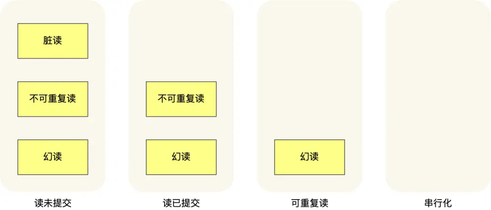

# 事务
> 事务是由 MySQL 的存储引擎实现的，但是不是所有的存储引擎都支持事务，原生的 MyISAM 就不支持事务，而 InnoDB 则支持事务，因此 MySQL 5.5 版本后默认 InnoDB 为存储引擎。

## 事务的特性
### ACID
- 原子性（Automicity）：一个事务中的所有操作，要么全部完成，要么全部不完成。
- 一致性（Consistency）：事务操作前后，数据满足完整性约束，数据库保持一致性。
- 隔离性（Isolation）：数据库允许多个并行事务同时对其数据进行读写和修改。
- 持久性（Durability）：事务完成后，对数据的修改是永久性的，即使故障也不会丢失。

### 保证事务特性的技术
- 原子性由 undo log 来保证
- 持久性由 redo log 来保证
- 隔离性由 MVCC 或 锁机制 来保证
- 一致性由原子性 + 持久性 + 隔离性来保证

## 并行事务
### 问题
- 脏读：一个事务读到另一个未提交事务修改过的数据
- 不可重复读：一个事务内多次读同一数据，前后数据不一致
- 幻读：一个事务内多次查询符合同一条件的记录数量，前后数量不一致

### 隔离级别
- 串行化：对记录加上读写锁，并行事务对同一记录发生读写冲突时，事务互斥
- 可重复读：一个事务执行过程中，读取的数据与事务开启时读取的数据一致
- 读已提交：一个事务提交后，其修改的数据才能被其它事务读取
- 读未提交：一个事务未提交时，其修改的数据也能被其它事务读取

### 实现隔离级别的技术
- 串行化由读写锁实现
- 可重复读由 Read View 实现，启动事务时生成 Read View
- 读已提交由 Read View 实现，每个语句执行前重新生成 Read View
- 读未提交直接读记录的最新版本

### 问题&隔离级别
- 问题严重性：脏读 > 不可重复读 > 幻读
- 事务隔离级别：串行化 > 可重复读(默认) > 读已提交 > 读未提交

不同隔离级别下并行事务会发生的问题：



MySQL InnoDB 存储引擎的默认隔离级别是可重复读，它很大程度上也避免了幻读现象
- 针对快照读（普通 select 语句），是通过 MVCC 方式解决了幻读，因为可重复读隔离级别下，事务执行过程中看到的数据，一直跟这个事务启动时看到的数据是一致的，即使中途有其他事务插入了一条数据，是查询不出来这条数据的，所以就很好了避免幻读问题。
- 针对当前读（select ... for update 等语句），是通过 next-key lock（记录锁+间隙锁）方式解决了幻读，因为当执行 select ... for update 语句的时候，会加上 next-key lock，如果有其他事务在 next-key lock 锁范围内插入了一条记录，那么这个插入语句就会被阻塞，无法成功插入，所以就很好了避免幻读问题。

## 隐藏字段
> InnoDB 提供的 Compact 行格式中，一条记录分为`记录的额外信息`和`记录的真实数据`两部分，记录的真实数据部分除了我们自己定义的字段，还有 3 个隐藏字段，row_id(非必须)、trx_id、roll_pointer。

### 字段
- trx_id：创建/修改/删除该记录的事务的事务 ID
- roll_pointer：将 undo log 中该记录的不同版本串联起来，称作版本链

## Read View
> Read View 是 MySQL 的快照，记录数据库某时刻的数据信息，该快照被用于 InnoDB 存储引擎中的 MVCC 机制。Read View 会根据事务的隔离级别决定在某个事务开始时，判断版本链中哪个版本是当前事务可见的。

### 字段
- creator_trx_id：创建该 Read View 的事务的事务 ID
- m_ids：创建该 Read View 时，活跃事务的事务ID列表(启动了还未提交的事务)
- min_trx_id：创建该 Read View 时，活跃事务的最小事务 ID
- max_trx_id：创建该 Read View 时，全局事务的最大事务 ID+1

### 规则
- 如果记录的 trx_id 值小于 Read View 中的 min_trx_id 值，表示这个版本的记录是在创建 Read View 前已经提交的事务生成的，所以该版本的记录对当前事务可见。
- 如果记录的 trx_id 值大于等于 Read View 中的 max_trx_id 值，表示这个版本的记录是在创建 Read View 后才启动的事务生成的，所以该版本的记录对当前事务不可见。
- 如果记录的 trx_id 值在 Read View 的 min_trx_id 和 max_trx_id 之间，需要判断 trx_id 是否在 m_ids 列表中：
    - 如果记录的 trx_id 在 m_ids 列表中，表示生成该版本记录的活跃事务依然活跃着（还没提交事务），所以该版本的记录对当前事务不可见。
    - 如果记录的 trx_id 不在 m_ids列表中，表示生成该版本记录的活跃事务已经被提交，所以该版本的记录对当前事务可见。

### 隔离级别
- 串行化由 读写锁 实现
- 可重复读由 Read View 实现，启动事务时生成 Read View 快照
- 读提交由 Read View 实现，每个语句执行前重新生成 Read View 快照
- 读未提交直接读记录的最新版本

## MVCC
> MVCC(多版本并发控制)，通过记录的多个版本管理来实现数据库的并发控制。MVCC 的设计是为了避免串行化隔离级别下通过加读写锁的方式处理读写冲突时导致的性能影响，用不加锁的方式处理读写冲突来提高数据库的并发性能。MVCC 的实现依赖于：隐藏字段、undo log、Read View。

### 流程
1. 根据特定的隔离级别，决定何时创建 Read View 快照
2. 获取记录数据
3. 遍历 undo log 中的版本链
4. 根据 Read View 规则比对
5. 返回符合 Read View 规则的记录版本

## 幻读
> 在串行化隔离级别下通过加`读写锁`的方式解决幻读问题，但是非常影响性能，于是在可重复读隔离级别下通过引入`MVCC`来解决`快照读`的幻读问题，`next-key lock`(记录锁+间隙锁)来解决`当前读`的幻读问题，在不影响性能的情况下最大程度上解决幻读问题。

### 快照读
快照读，根据 Read View 快照读取记录(记录可能是版本链中的历史版本)。不加锁的简单 SELECT 属于快照读。快照读是基于提高并发性能的考虑，基于 MVCC 避免了加锁操作，降低了开销。 快照读的前提是隔离级别不是串行级别，串行级别下的快照读会退化成当前读。
```
SELECT * FROM users WHERE id < 10
```
### 当前读
当前读，直接读取记录的最新版本。加锁的 SELECT，或者对数据进行增删改都属于当前读。读取时要保证其他并发事务不能修改当前记录，会对读取的记录进行加锁。
```
SELECT * FROM student LOCK IN SHARE MOD; # 共享锁
SELECT * FROM student FOR UPDATE; # 独占锁
INSERT INTO student values ...  # 独占锁
DELETE FROM student WHERE ...  # 独占锁
UPDATE student SET ...  # 独占锁
```
当前读实际上是一种加锁的操作，是悲观锁的实现。而 MVCC 本质是采用乐观锁思想的一种方式。

### 幻读
可重复读隔离级别下只能尽最大程度避免幻读，但仍存在幻读可能：
- 对于快照读， MVCC 并不能完全避免幻读现象。虽然可重复读提供了事务开始时的数据快照，但这个快照通常是指对已经存在的数据行的快照，而不是整个表结构的快照。因此，新的行可以被其他事务添加到表中，并且在后续查询中可见。
- 对于当前读，如果事务开启后，并没有执行当前读，而是先快照读，然后这期间如果其他事务插入了一条记录，那么事务后续使用当前读进行查询的时候，就会发现两次查询的记录条目就不一样了，所以就发生幻读。

## 总结
MVCC 机制就是为了解决串行化隔离级别下通过加读写锁的方式解决读写冲突产生的性能影响，在可重复读隔离级别下，通过不加锁的方式最大程度上解决并发事务出现的幻读问题，提高数据库的并发性能。MVCC 是通过 Read View + 版本链（undo log + 隐藏字段）实现的，Read View 提供规则和快照，不同隔离级别下快照不同，根据 Read View 规则可见的记录版本也不同，以此来实现不同的隔离级别，MVCC 再根据 Read View 规则在版本链中找寻符合 Read View 规则当前事务可见的记录版本，以此来实现并发事务操作同一记录的不同版本，在不加锁的情况下互不影响，来保证事务的隔离性。