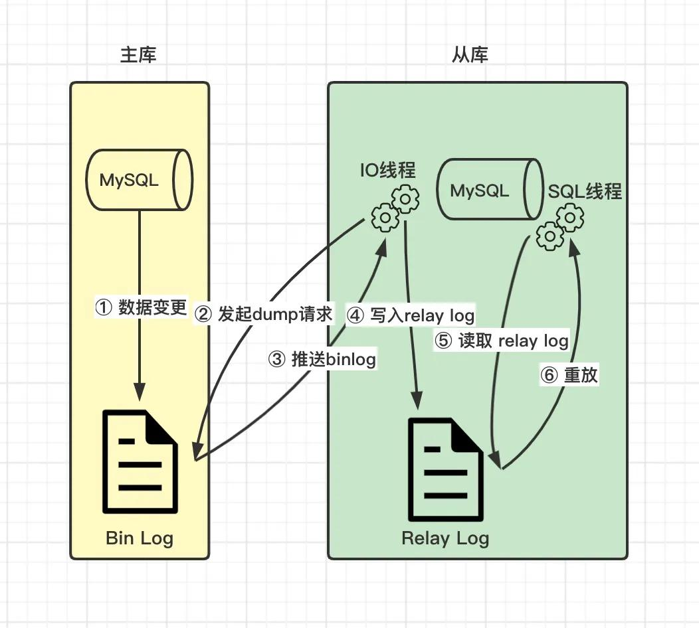

# binlog
binlog（二进制日志文件） —— 记录所有的数据表结构变更和表数据修改操作的日志。

> binlog 是 MySQL 的 Sever 层实现的日志，所有存储引擎都可以使用，但是没有恢复崩溃（crash-safe）的能力，所以 InnoDB 存储引擎引入了 redo log

## binlog vs. redo log
适用对象
- binlog 是 MySQL 的 Sever 层实现的日志，所有存储引擎都可以使用
- redo log 是 InnoDB 存储引擎实现的日志

记录对象
- binlog 根据不同情况，选择记录所有的数据表结构变更和表数据修改的操作指令或修改后的所有记录
- redo log 记录对数据页的修改

写入方式
- binlog 是追加写，不会覆盖，是全量的数据
- redo log 是循环写，会覆盖

用途
- binlog 用于备份恢复，主从复制
- redo log 用于崩溃恢复

崩溃恢复（crash-safe）是恢复内存中还没有刷入磁盘的脏页数据。bin log 是追加日志，保存的是全量的日志，这就会导致一个问题，那就是没有标志能让 InnoDB 从 bin log 中判断哪些数据已经刷入磁盘了，哪些数据还没有，数据库重启后，恢复哪些数据至内存是不知道的；但 redo log 不一样，只要刷入磁盘的数据，redo log 都会记录，数据库重启后，直接把 redo log 中的数据都恢复至内存就可以了。所以 redo log 具有崩溃恢复的能力，而 bin log 不具备。

## binlog 实现主从复制

`异步复制`的主从复制过程：
1. 当主库数据发生变更时，写入本地 bin log 文件
2. 从库 IO 线程发起 dump 主库 bin log 文件的请求
3. 主库 IO 线程推送 bin log 文件到从库中
4. 从库 IO 线程把 bin log 内容写入本地的 relay log 文件中
5. 从库 SQL 线程读取 relay log 文件内容
6. 从库 SQL 线程重新执行一遍 SQL 语句

## binlog 刷盘策略
事务执行过程中，先把日志写到 binlog cache（Sever 层的 cache），当事务提交时，再把 binlog cache 写入 binlog 文件中，每个线程有自己的 binlog cache，最终都写入同一个 binlog 文件，并清空 binlog cache。

sync_binlog 参数：  
= 0（默认），每次提交事务都只 write，不 fsync，操作系统决定 fsync 时间  
= 1，每次提交事务都 write，然后马上执行 fsync  
= N，每次提交事务都 write，但累积 N 个事务后才 fsync