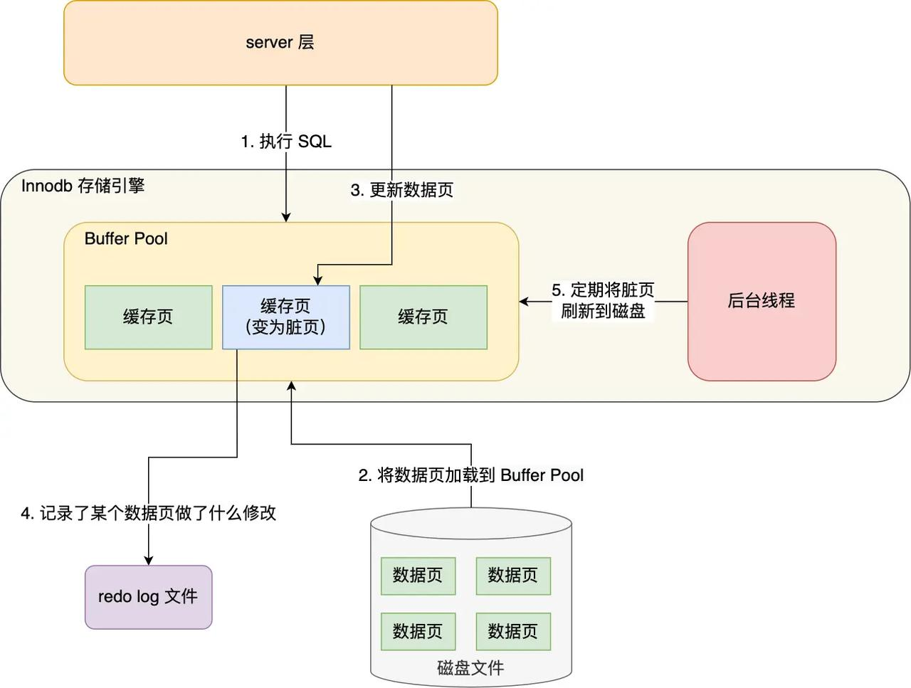
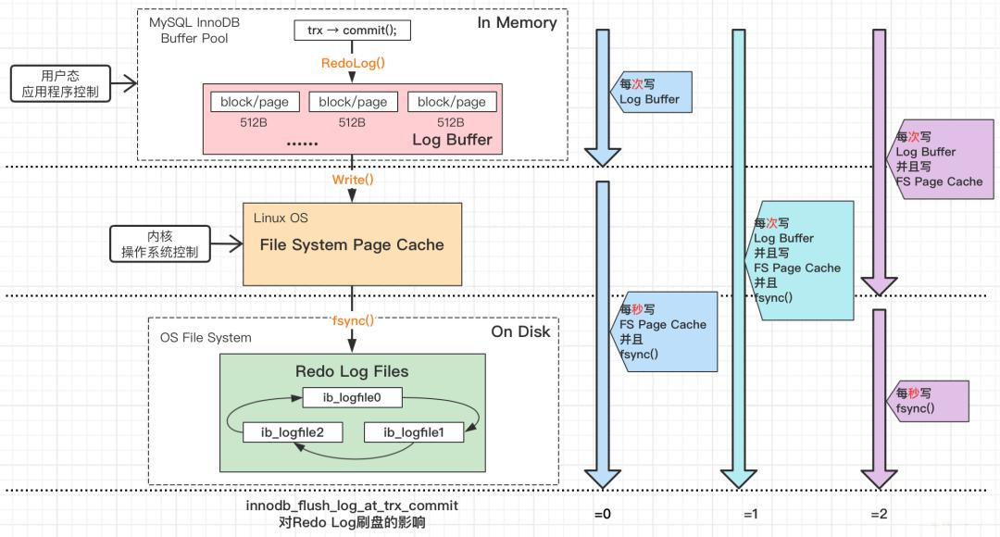
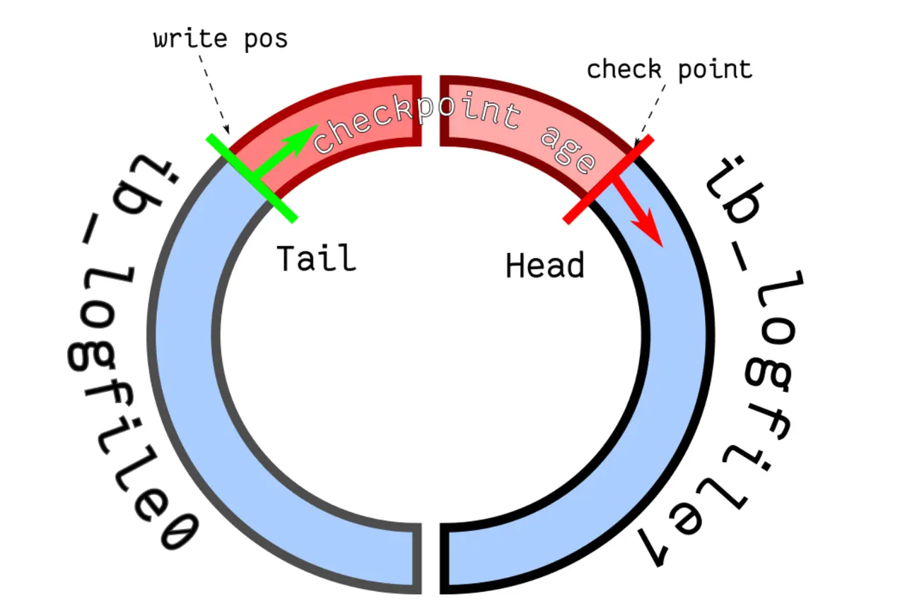

# redo log
redo log（重做日志） —— 记录断电后需要重做（undo）的数据

> 防止因意外断电导致 Buffer Pool 中脏页丢失致使内存和磁盘数据不一致，因此每次产生脏页时，要将对此页的修改更新到 redo log 中，就算记录更新完成，保证了事务的持久性（Durability）。后台线程选择合适时机统一将脏页写入磁盘，减少磁盘 I/O，即 WAL（Write-Ahead Logging）技术

事务提交时，只需将 redo log 持久化到硬盘即可，不需要等到把脏页持久化到硬盘，写入 redo log 的磁盘操作是顺序写，写入脏页数据的磁盘操作是随机写，磁盘的顺序写比随机写高效得多。

redo log 也不是直接写入磁盘的，因为磁盘的操作运行速度远慢于内存，所以 redo log 也有自己的缓存 Log Buffer 中的 redo log buffer，每产生一条 redo log 会先写入 redo log buffer 中，再持久化到硬盘。

## redo log 刷盘策略
- MySQL 正常关闭时
- 当 redo log buffer 中记录的写入量大于 redo log buffer 内存空间的一半时
- InnoDB 的后台线程每隔 1 秒，将 redo log buffer 持久化到磁盘
- 每次事务提交时都将缓存在 redo log buffer 里的 redo log 直接持久化到磁盘（innodb_flush_log_at_trx_commit 参数默认为 1 ）

  innodb_flush_log_at_trx_commit 参数  
  = 0，最佳性能  
  = 1，强一致性（默认）  
  = 2，折中（推荐）（性能差异不大，安全差异大）

## redo log 覆盖策略
- InnoDB 存储引擎有1个重做日志文件组（redo log Group)
- 由 ib_logfile0 和 ib_logfile1 两个 redo log 文件组成
- 两个文件循环写覆盖已刷盘的脏页

  
## redo log 作用
因此，redo log 有两大作用：
- 实现事务的持久性：让 MySQL 有崩溃恢复（crash-safe）的能力，能够保证 MySQL 在任何时间段突然崩溃，重启后之前已提交的记录都不会丢失。
- 将写操作从「随机写」变成了「顺序写」，提升了 MySQL 写入磁盘的性能。