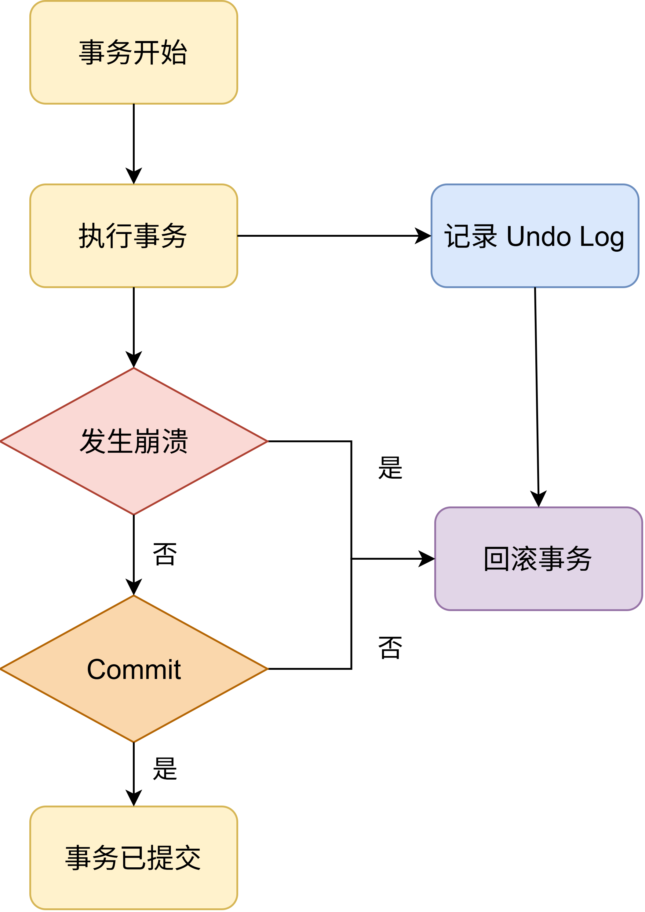
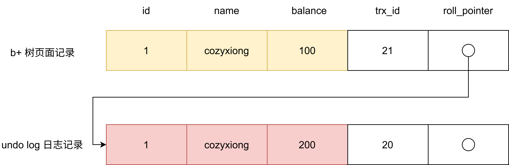

# undo log
undo log（回滚日志）—— 记录没有更新（undo）的数据。

> 在执行"增删改"语句时，MySQL 会隐式开启事务，执行完自动提交。开启事务后，MySQL 会将原记录更新到 undo log 中，当中途发生崩溃时，利用 undo log 回滚，保证了事务的原子性（Atomicity）

## undo log 原记录
- 插入：记录主键值，回滚时把主键值对应的记录删除
- 删除：记录所有内容，回滚时把内容重新插入到表中
- 更新：记录更新列的原值，回滚时把这些列更新为原值
  由于"增删改"不同操作，记录的格式也不同，但是都包含 trx_id 事务 id 和 roll_pointer 指针
- trx_id：创建/修改/删除该记录的事务的事务 ID
- roll_pointer：将 undo log 中该记录的不同版本串联起来，称作版本链

因此可以通过 ReadView + undo log 实现 MVCC（多版本并发控制）。

## undo log 作用
- 实现事务回滚，保障事务的原子性：事务处理过程中，如果出现了错误或者用户执行了 ROLLBACK 语句，MySQL 可以利用 undo log 中的历史数据将数据恢复到事务开始之前的状态
- 实现 MVCC 多版本控制：MVCC 是通过 ReadView + undo log 实现的：undo log 为每条记录保存多份历史数据，MySQL 在执行快照读(普通 select 语句)的时候，会根据事务的 Read View 里的信息，顺着 undo log 的版本链找到满足其可见性的记录。

记录的 undo log 写入 Buffer Pool 的 Undo 页