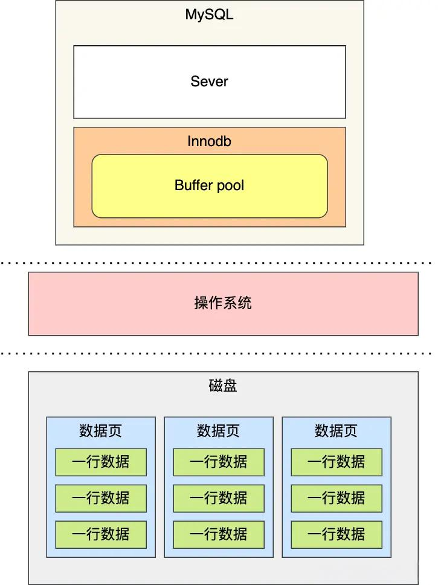
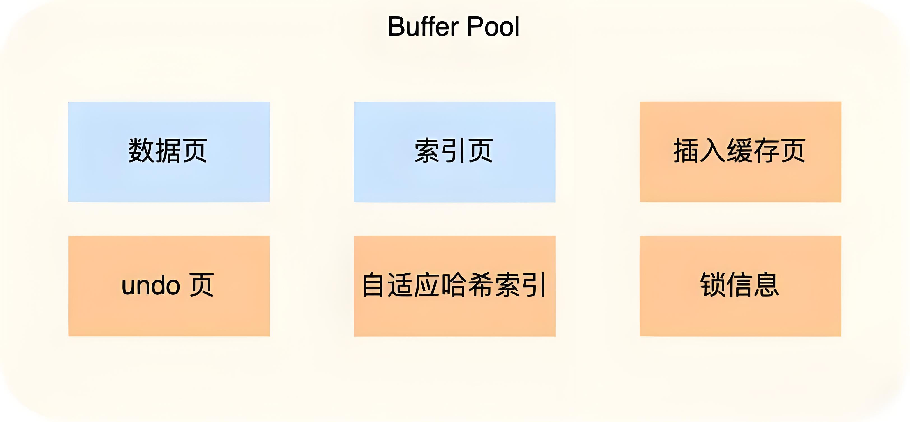
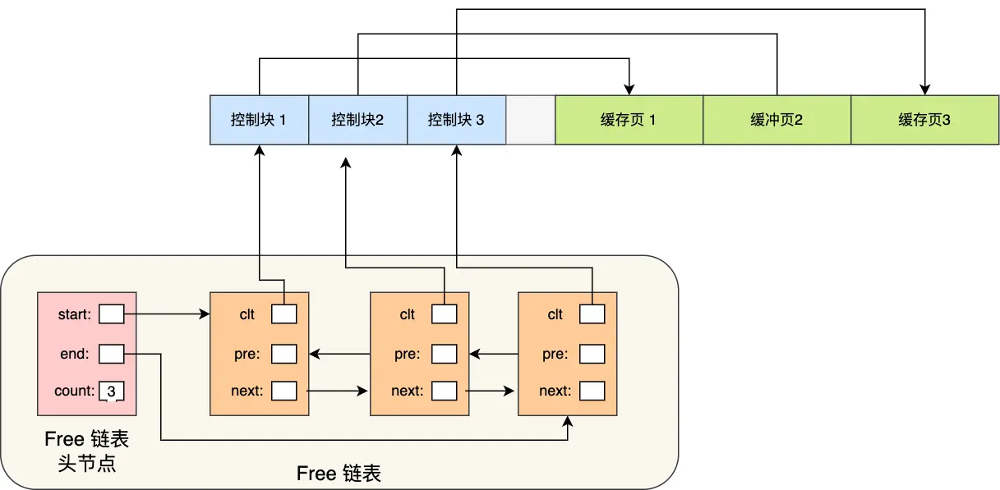

# Buffer Pool
InnoDB 存储引擎设计了一个缓冲池（Buffer Pool）
> 数据存储在磁盘，当从磁盘读取数据后，将数据先存放至内存的Buffer Pool中。
- 读取记录：先查询 Buffer Pool 是否命中，若命中直接读取
- 更新记录：先查询 Buffer Pool 是否命中，若命中直接修改，并设置为脏页（磁盘和内存数据不一致），记录 redo log，后台线程选择合适时机统一将脏页写入磁盘，减少磁盘 I/O，即 WAL（Write-Ahead Logging）技术

## 缓存页
InnoDB 的数据是按页进行读取的，页是 InnoDB 存储管理的最小单位，数据库每次读和写入磁盘都是 16KB 的数据，因此 InnoDB 中划分的 Buffer Pool 内存空间里的数据也是按页进行划分，称作`缓存页`。

缓存页包含数据页、索引页、undo页、插入缓存页、自适应哈希索引、锁信息等。

当我们查询一条记录时，InnoDB 是会把整个页的数据加载到 Buffer Pool 中，因为，通过索引只能定位到磁盘中的页，而不能定位到页中的一条记录。 将页加载到 Buffer Pool 后，再通过页里的页目录去定位到某条具体的记录。

## 缓存页管理
为了快速搜索和管理空闲页和脏页，Buffer Pool 中使用了`链表结构`

InnoDB 通过三种链表来管理缓存页：
- Free List（空闲页链表），管理空闲页
- Flush List（脏页链表），管理脏页
- LRU List，管理脏页 + 干净页，将最近且经常查询的数据缓存在其中，而不常查询的数据就淘汰出去。

## 缓存命中率
InnoDB 对 LRU 做了一些优化，我们熟悉的 LRU 算法通常是将最近查询的数据放到 LRU 链表的头部，而 InnoDB 做 2 点优化：
- 将 LRU 链表 分为young 和 old 两个区域，加入缓冲池的页，优先插入 old 区域； 页被访问时，才进入 young 区域，目的是为了解决预读失效的问题。
- 当「页被访问」且「 old 区域停留时间超过阈值（默认为1秒）」时，才会将页插入到 young 区域，否则还是插入到 old 区域，目的是为了解决批量数据访问，大量热数据淘汰的 Buffer Pool 污染问题。