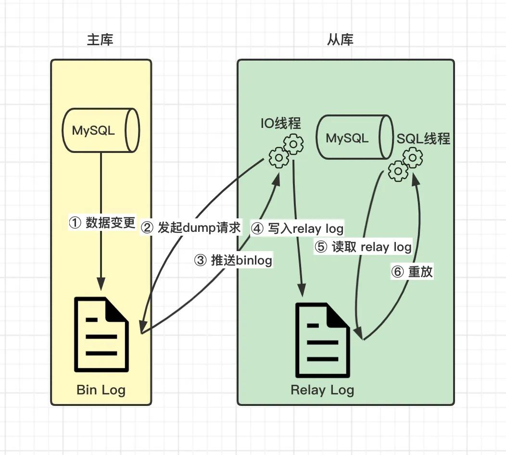
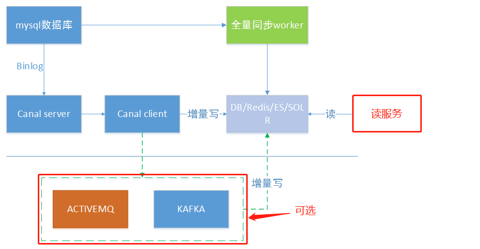

# 应用
## MySQL 和 Redis 的区别
- **MySQL** 是一个关系型数据库管理系统，用于存储持久化数据，支持复杂查询和事务。
- **Redis** 是一个内存数据库，用于缓存和快速数据存取，支持多种数据结构如字符串、哈希、列表、集合等。
- **用途：** Redis 用于缓存、高速数据操作；MySQL 用于持久化存储、复杂查询。

## 删除表/删除表数据
| 区别点               | drop                      | truncate                  | delete                    |
|----------------------|---------------------------|---------------------------|---------------------------|
| 执行速度             | 快                        | 较快                      | 慢                        |
| 命令分类             | DDL（数据定义语言）       | DDL（数据定义语言）       | DML（数据操作语言）       |
| 删除对象             | 删除整张表和表结构，以及表的索引、约束和触发器。 | 只删除表数据，表的结构、索引、约束等会被保留。 | 只删除表的全部或部分数据，表结构、索引、约束等会被保留。 |
| 删除条件(where)      | 不能用                    | 不能用                    | 可使用                    |
| 回滚                 | 不可回滚                  | 不可回滚                  | 可回滚                    |
| 自增初始值           | -                         | 重置                      | 不重置                    |

## group by/order by
- **GROUP BY**：分组聚合
- **ORDER BY**：排序结果集

## MySQL常用命令
- 删除数据库 drop database 数据库名
- 删除表 drop table 表名
- 删除数据 truncate table 表名
- 删除数据 delete from 表名 where 条件
- 添加数据 insert into 表名(字段) values (值1, 值2, ...)
- 更新数据 update 表名 set 字段 = 值 where 条件
- 添加字段 alter table 表名 add/delete 字段名 类型（长度）

**实例**
1. 查找员工薪资第一高/第二高/最高的5个的信息
```
SELECT * FROM employees ORDER BY salary DESC LIMIT 1;  -- 第一高
SELECT * FROM employees ORDER BY salary DESC LIMIT 1 OFFSET 1;  -- 第二高
SELECT * FROM employees ORDER BY salary DESC LIMIT 5;  -- 最高的5个
```
2. 表中姓李的男生
```
SELECT * FROM employees WHERE last_name LIKE '李%' AND gender = '男';
```
3. 查找每个用户最近登录时间
```
SELECT user_id, MAX(login_time) AS last_login FROM logins GROUP BY user_id;
```
4. 查找重复邮件
```
SELECT email, COUNT(*) FROM users GROUP BY email HAVING COUNT(*) > 1;
```
5. 将所有人的薪水提高30%
```
update employee set salary = salary*1.3
```

## MySQL 性能优化
[MySQL高性能优化规范建议](https://javaguide.cn/database/mysql/mysql-high-performance-optimization-specification-recommendations.html)
1. **定位问题：慢 SQL 定位**

性能优化的第一步永远是找到瓶颈，常用的慢 SQL 监控工具，如 MySQL 慢查询日志等。
```
## 开启慢查询日志，开启后将会记录执行时间超过 long_query_time 参数值的 SQL 语句（ 一般临时开启即可 ）
slow_query_log = 1
## 定义执行时间超过多少秒为慢查询，默认 10s
long_query_time = 1
## 定义慢查询日志存放位置
slow_query_log_file = /data/mysql/logs/slow.log

# 使用文本编辑器查看
vim /path/to/your/slow-query.log
# 或者使用MySQL自带的mysqldumpslow命令
mysqldumpslow -s at /path/to/your/slow-query.log
```
2. **分析问题：慢 SQL 分析**

找到慢 SQL，使用 EXPLAIN 命令查看执行计划，查看走没走索引、索引类型、索引字段等，来分析慢 SQL 的原因。

3. **解决问题：索引、表结构和 SQL 优化**

直接因素(索引)、根本因素(表结构设计)、人为因素(SQL语句)
- 索引：
    - 没有加索引：添加索引
    - 没有走索引：防止索引失效
    - 走索引仍慢：索引优化(前缀索引优化、覆盖索引优化等)
- 表结构：表结构优化
    - 选择合适的数据类型
    - 合理使用范式(无冗余，一致性)和反范式(有冗余，高效性)设计
- SQL 语句：SQL 语句优化
    - 避免使用 select *，仅查询需要的字段
    - 使用连接查询代替子查询(提高执行效率、降低锁争用)
    - 合理使用分页查询(限制每页的数据条数)
4. **进阶方案：架构优化**

除非在特定场景下有明显的性能瓶颈，否则不应轻易使用，因其引入的复杂性会带来额外的维护成本。
- 读写分离： [读写分离和分库分表详解](https://javaguide.cn/high-performance/read-and-write-separation-and-library-subtable.html)
    - 将读操作和写操作分离到不同的数据库实例，提升数据库的并发处理能力。
- 分库分表：
    -  将数据分散到多个数据库实例或数据表中，降低单表数据量，提升查询效率。但要权衡其带来的复杂性和维护成本，谨慎使用。
- 数据冷热分离：[数据冷热分离详解](https://javaguide.cn/high-performance/data-cold-hot-separation.html)
    - 根据数据的访问频率和业务重要性，将数据分为冷数据和热数据，冷数据一般存储在存储在低成本、低性能的介质中（HDD），热数据高性能存储介质中（SSD），进行分表或分库存储。
- 缓存机制：
    -  使用 Redis 等缓存中间件，将热点数据缓存到内存中，减轻数据库压力。这个非常常用，提升效果非常明显，性价比极高！
5. **其他方案：**
- 连接池配置： 配置合理的数据库连接池（如 连接池大小、超时时间 等），能够有效提升数据库连接的效率，避免频繁的连接开销。
- 硬件配置： 使用高性能服务器、增加内存、宽带、使用 SSD 硬盘等硬件升级，都可以有效提升数据库的整体性能。

## 读写分离
### 实现方式
1. 代理方式
   在应用和数据间加一个代理层，应用程序将所有的数据请求交给代理层处理，由代理层负责路由读写请求到对应的主从库。中间件有 MySQL Router、Cobar、Mycat 等。
2. 组件方式（推荐）
   通过引入第三方组件来实现读写分离，推荐使用 sharding-jdbc ，直接引入 jar 包即可使用，非常方便。同时，也节省了很多运维的成本。

### 主从复制
**binlog 实现主从复制**



`异步复制`的主从复制过程：
1. 当主库数据发生变更时，写入本地 bin log 文件
2. 从库 IO 线程发起 dump 主库 bin log 文件的请求
3. 主库 IO 线程推送 bin log 文件到从库中
4. 从库 IO 线程把 bin log 内容写入本地的 relay log 文件中
5. 从库 SQL 线程读取 relay log 文件内容
6. 从库 SQL 线程重新执行一遍 SQL 语句
   
**MySQL 数据同步到其它数据源**



Alibaba 开源的 Canal 中间件模拟 MySQL 主从复制的交互协议，伪装成 MySQL 的一个从节点，向 MySQL 主节点发送 dump 请求，主节点收到请求推送 Binlog 给 canal：
1. 通过 EventPaser 解析数据
2. 通过 EventSink 过滤归并数据
3. 通过 EventStore 存储数据(内存循环写)
4. 将数据传输给 Canal 客户端

Canal 客户端可以通过增量写的方式同步 MySQL 的数据到其它数据源，如 Redis、Elasticsearch、DB 等。

### 主从延迟
**强制将读请求路由到主库处理**

如果我们的业务场景无法容忍主从同步延迟，将那些必须获取最新数据的读请求都交给主库处理，这种方案虽然会增加主库的压力，但是实现起来比较简单，也是使用最多的一种方式。

比如 `Sharding-JDBC` 就是采用的这种方案。通过使用 Sharding-JDBC 的 `HintManager` 分片键值管理器，我们可以强制使用主库。
```
HintManager hintManager = HintManager.getInstance();
hintManager.setMasterRouteOnly(); // 继续 JDBC 操作
```

## 分库分表
### 分库
将数据库中的数据分散到不同的数据库上。
1. **垂直分库**

把单一数据库按照业务划分，不同的业务使用不同的数据库。

例：将数据库中的用户表、订单表和商品表分别单独拆分为用户数据库、订单数据库和商品数据库。

2. **水平分库**

把同一个表按一定规则拆分到不同的数据库中，实现水平扩展，解决单表的存储和性能瓶颈的问题。

例：订单表数据量太大，你对订单表进行了水平分表，然后将切分后的 2 张订单表分别放在两个不同的数据库。

### 分表
对单表的数据进行拆分。
1. **垂直分表**

对数据表字段进行拆分，把一张列比较多的表拆分为多张表。

例：将用户信息表中的一些字段单独抽出来作为一个表。

2. **水平分表（通常水平分表后水平分库）**

对数据表行进行拆分，把一张行比较多的表拆分为多张表。

例：将用户信息表拆分成多个用户信息表。

### 分片算法
分片算法主要解决数据水平分片后，存放在哪张表的问题。
- **哈希分片：** 求指定分片键的哈希，然后根据哈希值确定数据应被放置在哪个表中。哈希分片比较适合随机读写的场景，不太适合经常需要范围查询的场景。哈希分片可以使每个表的数据分布相对均匀，但对动态伸缩（例如新增一个表或者库）不友好。
- **范围分片：** 按照特定的范围区间（比如时间区间、ID 区间）来分配数据，比如 将 `id` 为 `1~299999` 的记录分到第一个表， `300000~599999` 的分到第二个表。范围分片适合需要经常进行范围查找且数据分布均匀的场景，不太适合随机读写的场景（数据未被分散，容易出现热点数据的问题）。
- **映射表分片：** 使用一个单独的表（称为映射表）来存储分片键和分片位置的对应关系。映射表分片策略可以支持任何类型的分片算法，如哈希分片、范围分片等。映射表分片策略是可以灵活地调整分片规则，不需要修改应用程序代码或重新分布数据。不过，这种方式需要维护额外的表，还增加了查询的开销和复杂度。

### 实现方式
ShardingSphere 项目（包括 Sharding-JDBC、Sharding-Proxy 和 Sharding-Sidecar）是当当捐入 Apache 的，目前主要由京东数科的一些巨佬维护。是一款分布式的数据库生态系统，可以将任意数据库转换为分布式数据库。

ShardingSphere 绝对可以说是当前分库分表的首选！ShardingSphere 的功能完善，除了支持读写分离和分库分表，还提供分布式事务、数据库治理、影子库、数据加密和脱敏等功能。

现在很多公司都是用的类似于 TiDB 这种分布式关系型数据库，不需要手动进行分库分表（数据库层面已经帮我们做了），也不需要解决手动分库分表引入的各种问题，直接一步到位，内置很多实用的功能（如无感扩容和缩容、冷热存储分离）

### 数据迁移
分库分表之后，我们如何将老库（单库单表）的数据迁移到新库（分库分表后的数据库系统）呢？
1. **停机迁移（常用）**

在系统使用人数比较少时，进行系统维护停服。然后，写一个脚本将老库的数据都同步到新库中。

2. **双写方案**

针对不能停机迁移的场景，实现稍麻烦。
- **双写：** 对老库的更新操作，同时写入新库。如果操作的数据不存在于新库，则插入到新库中。（可以借助 Canal 工具）
- **冗余数据清理：** 编写脚本将老库中的数据和新库的数据做比对。如果新库中没有，就把数据插入到新库。如果新库有，旧库没有，就把新库对应的数据删除。
- **重复：** 重复上一步的操作，直到老库和新库的数据一致为止。

