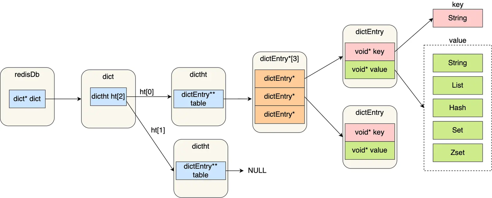
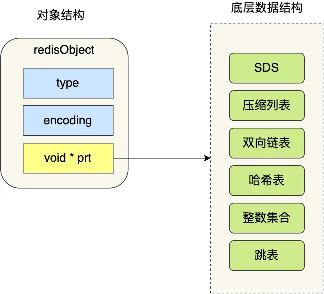
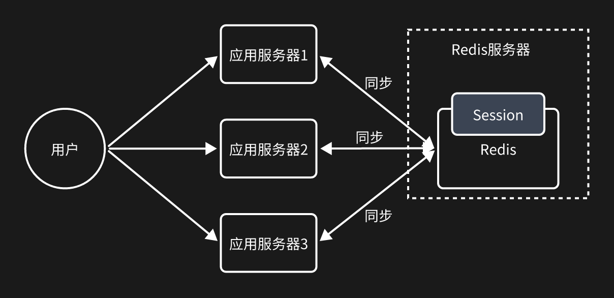
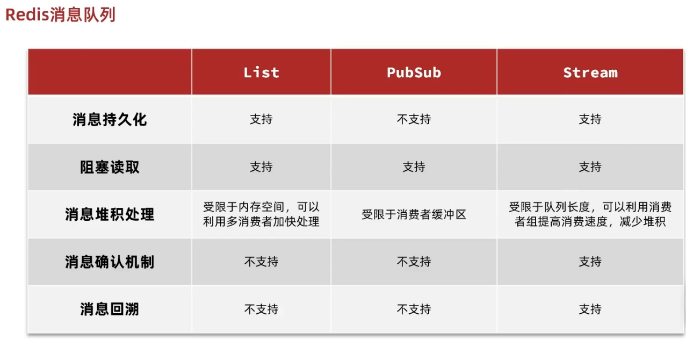
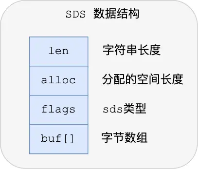
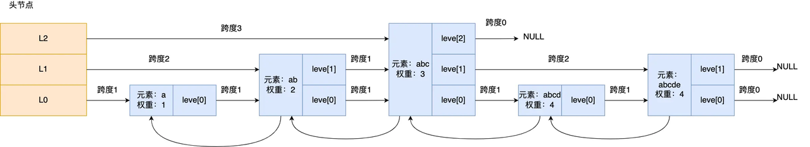
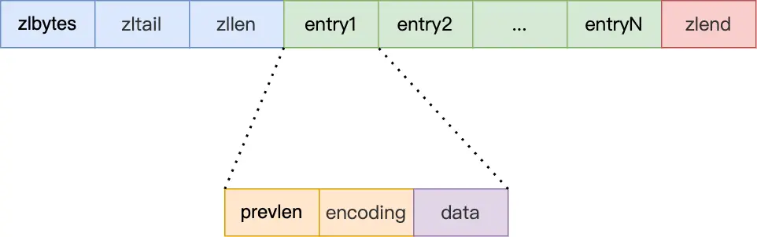
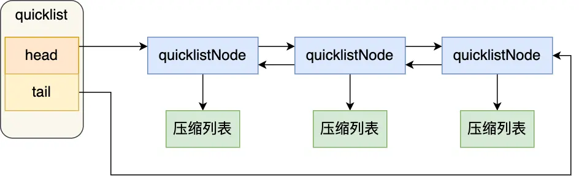
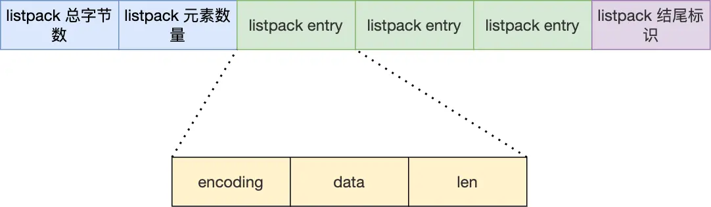

# 数据类型

> Redis 数据都是 key-value 结构，key 是唯一标识，value 是具体的值，value 提供了丰富的数据类型，常见的有5种数据类型：String（字符串）、List（列表）、Set（集合）、Zset（有序集合）、Hash（哈希），随着 Redis 版本的更新，后面又支持了 4 种：BitMap（2.2版新增）、HyperLogLog（2.8版新增）、GEO（3.2版新增）、Stream（5.0版新增）

## Redis 结构
> Redis 那么快，除了它是内存数据库，使得所有的操作都在内存上进行之外，还有一个重要因素，它实现的数据结构，使得我们对数据进行增删查改操作时，Redis 能高效的处理。

Redis 是键值对数据库，key 就是字符串对象，value 就是集合数据类型的对象（String、Hash、List、Set、Zset等），数据结构就是这些数据类型对象的底层实现。

Redis 是键值对数据库，底层的数据结构是哈希表，查询键值对的时间复杂度为 O(1)。哈希表其实就是一个数组，数组中的元素叫哈希桶，Redis 哈希桶中存放着指向键值对的指针（dictEntry*），因为键值对的值需要保存不同数据类型的对象，所以键值对的数据结构中并不直接保存数据本身，而是保存指向键对象和值对象的指针（void* key 和 void* value）。



而 void* key 和 void* value 指针指向的都是 Redis 对象，Redis 中的每个对象都由 redisObject 结构表示。



Redis 对象结构里包含的成员变量：
- type：标识该对象是什么数据类型的对象
- encoding：标识该对象使用了哪种底层的数据结构
- ptr：指向底层数据结构的指针

## 数据类型
### String
**value类型：** 字符串、数字（整数、浮点数）、二进制数据（图片、音频、视频）

**实现方式：** SDS（简单动态字符串）

**应用场景：**
- 缓存对象     SET user:1 '{"name":"cozyxiong", "sex":male}'
- 常规计数     INCR aritcle:readcount:1001
- 分布式锁     SET lock $uuid EX 20 NX
```
  -- 写入Lua脚本，让Redis执行，保证原子性
  -- 判断锁，并释放
  if redis.call("GET",KEYS[1]) == ARGV[1]
  then
  redis.call("DEL",KEYS[1])
  else
  return 0
  end
```  
- 共享Session信息



**常用命令：**
```
-- ***字符串***
-- 设置 key-value 类型的值
> SET name lin
OK
-- 根据 key 获得对应的 value
> GET name
"lin"
-- 批量设置 key-value 类型的值
> MSET key1 value1 key2 value2
OK
-- 批量获取多个 key 对应的 value
> MGET key1 key2
1) "value1"
2) "value2"
-- 判断某个 key 是否存在
> EXISTS name
(integer) 1
-- 返回 key 所储存的字符串值的长度
> STRLEN name
(integer) 3
-- 删除某个 key 对应的值
> DEL name
(integer) 1
-- 设置 key-value 类型的值

-- ***数字***
> SET number 0
OK
-- 将 key 中储存的数字值增一
> INCR number
(integer) 1
-- 将key中存储的数字值加 10
> INCRBY number 10
(integer) 11
-- 将 key 中储存的数字值减一
> DECR number
(integer) 10
-- 将key中存储的数字值键 10
> DECRBY number 10
(integer) 0

-- 设置 key 在 60 秒后过期（该方法是针对已经存在的key设置过期时间）
> EXPIRE name  60
(integer) 1
-- 查看数据还有多久过期
> TTL name
(integer) 51
-- 设置 key-value 类型的值，并设置该key的过期时间为 60 秒
> SET key value EX 60
OK
-- 不存在就插入（not exists）
>SETNX key value
(integer) 1
```

### Hash
**value类型：** key-value键值对

**实现方式：** listpack（紧凑列表）或哈希表

**应用场景：**
- 缓存对象    HMSET uid:1 name xmq age 22
  - 存储对象一般用 String+Json ，对于对象中频繁变更的属性可以抽出来用 Hash 存储
- 购物车      用户 id 为 key，商品 id 为 field，商品数量为 value
  - 添加商品：HSET cart:{用户id} {商品id} 1  
  - 添加数量：HINCRBY cart:{用户id} {商品id} 1  
  - 商品总数：HLEN cart:{用户id}  
  - 删除商品：HDEL cart:{用户id} {商品id}  
  - 获取购物车所有商品：HGETALL cart:{用户id}

**常用命令：**
```
-- 存储一个哈希表 key 的键值
HSET key field value   
-- 获取哈希表 key 对应的 field 键值
HGET key field
-- 在一个哈希表 key 中存储多个键值对
HMSET key field value [field value...]
-- 批量获取哈希表 key 中多个 field 键值
HMGET key field [field ...]       
-- 删除哈希表 key 中的 field 键值
HDEL key field [field ...]    
-- 返回哈希表 key 中 field 的数量
HLEN key       
-- 返回哈希表 key 中所有的键值
HGETALL key
-- 为哈希表 key 中 field 键的值加上增量 n
HINCRBY key field n
```

### List
**value类型：** 字符串或数字列表（有序、可以重复）
**实现方式：** quicklist（快速列表）
**应用场景：**
- 消息队列
    - 需求 
      - 消息保序：使用 LPUSH + RPOP
      - 阻塞读取：使用 BRPOP
      - 重复消息处理：生产者自行实现全局唯一 ID
      - 消息的可靠性：使用 BRPOPLPUSH
    - 缺点：
      - List 消息队列不支持消费组的实现，即多个消费者消费同一个消息-
      - Stream 消息队列不仅支持三大需求，还支持消费组

**常用命令：**
```  
-- 将一个或多个值 value 插入到 key 列表的表头（最左边），最后的值在最前面
LPUSH key value [value ...]
-- 将一个或多个值 value 插入到 key 列表的表尾（最右边）
RPUSH key value [value ...]
-- 移除并返回 key 列表的头元素
LPOP key     
-- 移除并返回 key 列表的尾元素
RPOP key
-- 返回列表 key 中指定区间内的元素，区间以偏移量 start 和 stop 指定，从 0 开始 LRANGE
key start stop
-- 从 key 列表表头弹出一个元素，没有就阻塞 timeout 秒，如果 timeout=0 则一直阻塞
BLPOP key [key ...] timeout
-- 从 key 列表表尾弹出一个元素，没有就阻塞 timeout 秒，如果 timeout=0 则一直阻塞
BRPOP key [key ...] timeout
```

### Set
**value类型：** 字符串或数字集合（无序、不可重复）

**实现方式：** 哈希表或整数集合

**应用场景：**
- 点赞
  - 用户点赞：SADD article:1 uid:1
  - 取消点赞：SREM article:1 uid:1
  - 点赞用户：SMEMBER article:1
  - 点赞数量：SCARD article:1
  - 是否点赞：SISMEMBER article:1 uid:1
- 共同关注
  - 用户关注：SADD uid:1 1,3,4,5
  - 共同关注：SINTER uid:1 uid:2
  - 推荐关注：SDIFF uid:1 uid:2
  - 是否关注：SISMEMBER uid:1 5
- 抽奖活动
  - 参与用户：SADD box:1 xmq,tom,jack
  - 中奖用户：SPOP box:1 1

**常用命令：**
```
-- 往集合 key 中存入元素，元素存在则忽略，若 key 不存在则新建
SADD key member [member ...]
-- 从集合 key 中删除元素
SREM key member [member ...]
-- 获取集合 key 中所有元素
SMEMBERS key
-- 获取集合 key 中的元素个数
SCARD key
-- 判断 member 元素是否存在于集合 key 中
SISMEMBER key member
-- 从集合 key 中随机选出 count 个元素，元素不从 key 中删除
SRANDMEMBER key [count]
-- 从集合 key 中随机选出 count 个元素，元素从 key 中删除
SPOP key [count]

-- 交集运算
SINTER key [key ...]
-- 将交集结果存入新集合 destination 中
SINTERSTORE destination key [key ...]
-- 并集运算 S
UNION key [key ...]
-- 将并集结果存入新集合 destination 中
SUNIONSTORE destination key [key ...]
-- 差集运算
SDIFF key [key ...]
-- 将差集结果存入新集合 destination 中
SDIFFSTORE destination key [key ...]
```

### Zset
**value类型：** 字符串或数字集合（有序、不可重复）

**实现方式：** listpack（紧凑列表）或跳表

**应用场景：**
- 排行榜
  - 新增点赞：ZINCRBY user:1:ranking 1 article:1
  - 查看点赞：ZSCORE user:1:ranking article:1
  - 点赞前三：ZREVERANGE user:1:ranking 0 3 WITHSCORES
- 电话、姓名排序
  - 存储电话：ZADD phone 0 13820332112 0 13220332113 0 13420332114
  - 所有电话：ZRANGEBYLEX phone - +
  - 132号段：ZRANGEBYLEX phone [132 (133
    
**常用命令：**
```
-- 往有序集合 key 中加入带分值元素
ZADD key score member [score member]...
-- 往有序集合 key 中删除元素
ZREM key member [member...]                 
-- 返回有序集合 key 中元素 member 的分值
ZSCORE key member
-- 返回有序集合 key 中元素个数
ZCARD key
-- 为有序集合 key 中元素 member 的分值加上 increment
ZINCRBY key increment member
-- 正序获取有序集合 key 从 start 下标到 stop 下标的元素
ZRANGE key start stop [WITHSCORES]
-- 倒序获取有序集合 key 从 start 下标到 stop 下标的元素
ZREVRANGE key start stop [WITHSCORES]
-- 返回有序集合中指定分数区间内的成员，分数由低到高排序。
ZRANGEBYSCORE key min max [WITHSCORES] [LIMIT offset count]
-- 返回指定成员区间内的成员，按字典正序排列, 分数必须相同。
ZRANGEBYLEX key min max [LIMIT offset count]
-- 返回指定成员区间内的成员，按字典倒序排列, 分数必须相同
ZREVRANGEBYLEX key max min [LIMIT offset count]
-- 并集计算(相同元素分值相加)，numberkeys 一共多少个 key，WEIGHTS 每个 key 对应的分值乘积
ZUNIONSTORE destkey numberkeys key [key...]
-- 交集计算(相同元素分值相加)，numberkeys 一共多少个 key，WEIGHTS 每个 key 对应的分值乘积
ZINTERSTORE destkey numberkeys key [key...]
```

### BitMap
**value类型：** 二进制数组

**实现方式：** String

**应用场景：**
- 签到统计
  - 记录签到：SETBIT uid:1:sign:202409 4 1    #2024年9月5日签到
  - 检查签到：GETBIT uid:1:sign:202409 0 1    #检查2024年9月1日是否签到
  - 签到次数：BITCOUNT uid:1:sign:202409
  - 首次签到：BITPOS uid:1:sign:202409 1
- 登陆状态
  - 用户登录：SETBIT user 1 1;
  - 是否登录：GITBIT user 1;
  - 用户退出：SETBIT user 1 0;
- 连续签到用户统计
  - 连续签到：BITOP AND destmap bitmap:01 bitmap:02 bitmap:03
  - 数量统计：BITCOUNT destmap
  
**常用命令：**
```
-- 设置值，其中 value 只能是 0 和 1
SETBIT key offset value
-- 获取值
GETBIT key offset
-- 获取指定范围内值为 1 的个数（start和end以字节为单位）
BITCOUNT key start end
-- BitMap 间的运算
-- 位移操作，计算的结果，会存储在该 key 中
AND 与运算 &  
OR 或运算 |  
XOR 异或 ^  
NOT 取反 ~
-- 当 BITOP 处理不同长度的字符串时，较短的那个字符串所缺少的部分会被看作 0。返回值是保存到 destkey 的字符串的长度（以字节 byte 为单位），和输入 key 中最长的字符串长度相等。
BITOP [operations] [result] [key1] [keyn…]
-- 返回指定 key 中第一次出现指定 value(0/1) 的位置
BITPOS [key] [value]
```

### HyperLogLog
**value类型：** 字符串或数字集合（无序、不可重复）

（与 Set 区别：专用于大数据的数量估算（标准误算率0.81%），固定只消耗 12KB 内存）

**实现方式：** 数学算法

**应用场景：**
- 百万级网页 UV（独立访客数）计数
  - 记录用户：PFADD page1:uv user1 user2 user3
  - 数量估算：PFCOUNT page1:uv

**常用命令：**
```
-- 添加指定元素到 HyperLogLog 中
PFADD key element [element ...]
-- 返回给定 HyperLogLog 的基数估算值。
PFCOUNT key [key ...]
-- 将多个 HyperLogLog 合并为一个 HyperLogLog
PFMERGE destkey sourcekey [sourcekey ...]
```

### GEO
**value类型：** 地理位置信息

**实现方式：** ZSet + GeoHash 编码（经纬度区间编码值作为权重）

**应用场景：**
- 滴滴叫车
  - 车辆位置：GEOADD car:location 112.042352 32.342136 22    #22号车辆的位置信息
  - 附近车辆：GEORADIUS car:location 111.012312 33.234123 5 km ASC COUNT 10

**常用命令：**
```
-- 存储指定的地理空间位置，可以将一个或多个经度（longitude）、纬度（latitude）、位置名称（member）添加到指定的 key 中。
GEOADD key longitude latitude member [longitude latitude member ...]
-- 从给定的 key 里返回所有指定名称（member）的位置（经度和纬度），不存在的返回 nil。
GEOPOS key member [member ...]
-- 返回两个给定位置之间的距离。
GEODIST key member1 member2 [m|km|ft|mi]
-- 根据用户给定的经纬度坐标来获取指定范围内的地理位置集合。
GEORADIUS key longitude latitude radius m|km|ft|mi [WITHCOORD] [WITHDIST] [WITHHASH] [COUNT count] [ASC|DESC] [STORE key] [STOREDIST key]
```

### Stream
**value类型：** 字符串列表

**实现方式：** 高级列表

**应用场景：**
- 消息队列
1. 需求：
   - 消息保序：XADD/XREAD
   - 阻塞读取：XREAD block
   - 重复消息处理：Stream 在使用 XADD 命令，会自动生成全局唯一 ID；
   - 消息可靠性：内部使用 PENDING List 自动保存消息，使用 XPENDING 命令查看消费组已经读取但是未被确认的消息，消费者使用 XACK 确认消息；
   - 支持消费组形式消费数据
2. Redis 消息队列 vs. 专业消息队列（RabbitMQ、Kafka）
   - Redis 在持久化和主从复制时是异步的可能会丢数据；而专业消息队列通常部署的是集群，有多个节点也就是多个副本。
   - Redis 在消息堆积时，内存资源会紧张，且可能丢失数据；而专业消息队列是将数据存储在磁盘上的。
3. 能否将 Redis 作为消息队列来使用，关键看你的业务场景：
   - 如果你的业务场景足够简单，对于数据丢失不敏感，而且消息积压概率比较小的情况下，把 Redis 当作队列是完全可以的。
   - 如果你的业务有海量消息，消息积压的概率比较大，并且不能接受数据丢失，那么还是用专业的消息队列中间件。

**常用命令：**
```
XADD：插入消息，保证有序，可以自动生成全局唯一ID
XLEN：查询消息长度
XREAD：用于读取消息，可以按ID读取数据
XDEL：根据消息ID删除消息
DEL：删除整个Stream
XRANGE：读取区间消息
XREADGROUP：按消费组形式读取消息
XPENDING和XACK：
XPENDING 命令可以用来查询每个消费组内所有消费者「已读取、但尚未确认」的消息
XACK 命令用于向消息队列确认消息处理已完成
```


## 数据结构
### SDS
SDS（简单动态字符串），Redis 用 SDS 作为 String 数据类型的数据结构，而在 C 语言中采用 char*（字符数组）作为 String 数据类型的数据结构。

字符数组的弊端
- 获取字符长度的时间复杂度为 O(n)
- 无法保存二进制数据（字符中不能包含“/0”）
- 字符串操作不安全（不会记录缓存区大小）

而SDS则解决了以上全部问题。

SDS的数据结构：



len：记录字符串长度。（获取字符串长度时间复杂度只需要 O(1)；字符串中不需要“/0”来标记字符串结尾，因此可以保存二进制数据）。  
alloc：记录字符数组的空间长度。（操作字符串时会自动将 SDS 的空间扩展至执行修改所需的大小）  
flags：标记不同类型的 SDS。（一共5种类型，根据不同数据，划分不同数据结构中的 len 和 alloc 成员变量的数据大小，节省内存空间）  
buf[]：字符数组保存实际数据。（可以保存字符串和二进制数据）

### 哈希表
Redis 用哈希表作为 HASH 和 SET 数据类型的数据结构，哈希表本质上也是一个数组，数组里每一个元素是哈希桶，桶里存放指向相同哈希值节点链表的指针，即链式哈希，避免了哈希冲突。

而随着链表长度增加，查询这一哈希值节点的时间就会变长，因此 Redis 设计了渐进式哈希（rehash）机制。在 Redis 中，rehash 是指当哈希表的负载因子（节点/槽位）超过设定阈值时，为了保证哈希表的性能，系统会自动触发 rehash 操作，将原有哈希表的键值对经过多次迁移重新映射到一个更大的哈希表上。

Redis 结构中 dict 结构体中定义了两个哈希表 dictht。


rehash操作：
1. Redis 首先为 ht[1] 申请更大的内存空间，槽位数为 ht[0] 的两倍。
2. 每次对 ht[0] 元素操作时，都会顺序取出一个槽位的所有键值对。
3. Redis 重新计算每个键值对的哈希值，并根据 ht[1] 的槽位数取模确定对应槽位。
4. Redis 将该键值对从 ht[0] 的槽位中删除，并将其插入到 ht[1] 的对应槽位中。
5. 重复 2~4，这期间操作会同时在两个哈希表中进行，直到 ht[0] 的所有槽位迁移完。
6. 释放 ht[0] 内存空间，切换至 ht[1]。

### 整数集合
Redis 用整数集合作为 SET 数据类型的数据结构，整数集合本质也是一个数组，而为了节省内存空间，Redis 设计了升级规则，当大数据类型的新元素加入小数据类型的集合时，才会将小数据类型集合扩容为大数据类型。一旦升级，就一直保持升级后的状态。

### 跳表
Redis 用跳表作为 ZSET 数据类型的数据结构，链表查找元素的时间复杂度为 O(n)，跳表实现了多层链表，降低了查询的时间复杂度。本质是将有序大链表按随机化算法（概率分布）分出几条有序小链表，在小链表中遍历查找。



跳表结构体
```
typedef struct zskiplist {
//头尾节点
struct zskiplistNode *header, *tail;
//跳表长度
unsigned long length;
//跳表最大层数
int level;
} zskiplist;
```
跳表节点的结构
```
typedef struct zskiplistNode {
//元素
sds ele;
//权重(按权重排序)    
double score;
//后向指针(指向前一个节点)(方便倒序查找)    
struct zskiplistNode *backward;
//节点的level数组
struct zskiplistLevel {
//level数组的前向指针(指向同level的后一个节点)
struct zskiplistNode *forward;
//跨度(计算位置)
unsigned long span;
} level[];
} zskiplistNode;
```
跳表层数

跳表的相邻两层的节点数量最理想的比例是 2:1，查找复杂度可以降低到 O(logN)。

策略：跳表在创建节点时候，会生成范围为 [0-1] 的一个随机数，如果这个随机数小于 0.25（相当于概率 25%），那么层数就增加 1 层，然后继续生成下一个随机数，直到随机数的结果大于 0.25 结束，最终确定该节点的层数。确保层数越高，概率越低。

查询过程

跳表从头节点的最高层开始，逐一遍历每一层。
- 如果当前节点的权重「小于」要查找的权重时，跳表访问该层的下一个节点。
- 如果当前节点的权重「等于」要查找的权重时，并且当前节点的 SDS 类型数据「小于」要查找的数据时，跳表访问该层的下一个节点。
- 当下一个节点为空时，跳表访问下一层的头节点。

为什么用跳表而不用自平衡二叉查找树（AVL树、红黑树）
- 内存占用更灵活。平衡树每个节点 2 个指针（二叉），而跳表每个节点指针数（平均层数）为 1/(1-p)，具体取决于参数 p 的大小。如果像 Redis 里 p=1/4，那么平均每个节点包含 1.33 个指针，比平衡树更有优势。
- 范围查找效率更高。平衡树需要中序遍历来范围查询；跳表只需遍历链表。
- 更新节点效率更高。平衡树更新操作可能引发子树的调整；跳表只需修改相邻节点的指针。

### 压缩列表
压缩列表是 Redis 为了节约内存而开发的，是可变长数组。



结构体

zlbytes：记录压缩列表内存空间  
zltail：记录压缩列表表尾偏移量  
zllen：记录压缩列表节点数量  
zlend：标记压缩列表结束点(0xFF)  

节点

prevlen：记录前一个节点的长度(倒序遍历)  
encoding：记录节点数据的类型和长度(字符串和整数)  
data：记录节点数据  

压缩列表可根据 prevlen 和 encoding 的值，来分配不同的空间大小。当压缩列表新增或修改某个元素时，如果空间不够，就需要重新分配空间，若该元素较大，则会导致后面的元素都要重新分配空间（prevlen 改变），引起连锁更新。所以，压缩列表只用于保存的节点不多的情况。Redis 后续新增的两种数据结构 quicklist（Redis 3.2）和 listpack（Redis 5.0），就是为了解决压缩列表的连锁更新的问题。

### quicklist
quicklist（快速列表），Redis 用 quicklist 作为 List 数据类型的数据结构，quicklist 就是「双向链表 + 压缩列表」，quicklist 是一个双向链表，而链表中的每个节点就是压缩列表。



向 quicklist 添加元素时，会检查插入位置的压缩列表能否容纳该元素，如果能容纳就直接保存到压缩列表，如果不能容纳，才会新建一个新的 quicklistNode 结构。quicklist 会控制 quicklistNode 结构里的压缩列表的大小或元素个数，来减少连锁更新问题。

### listpack
listpack（紧凑列表），Redis 用 listpack 作为 HASH 和 ZSET 数据类型的数据结构，listpack 设计的目的是彻底解决压缩列表的连锁更新问题。



listpack 没有压缩列表中记录前一个节点长度的字段了，listpack 只记录当前节点的长度，当我们向 listpack 加入一个新元素的时候，不会影响其他节点的长度字段的变化，从而避免了压缩列表的连锁更新问题。