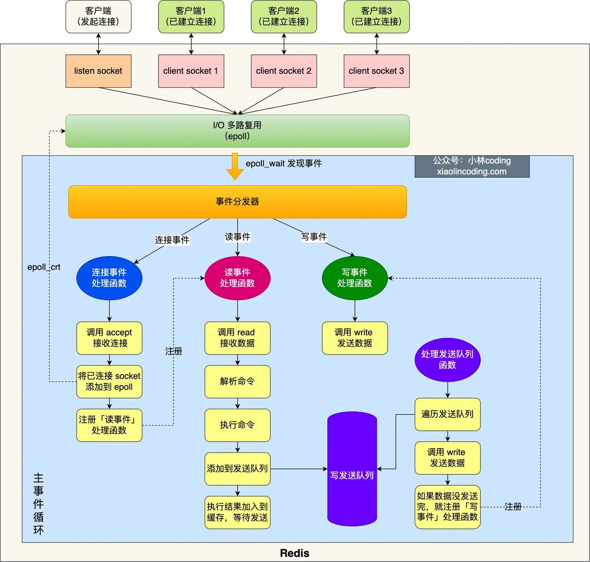
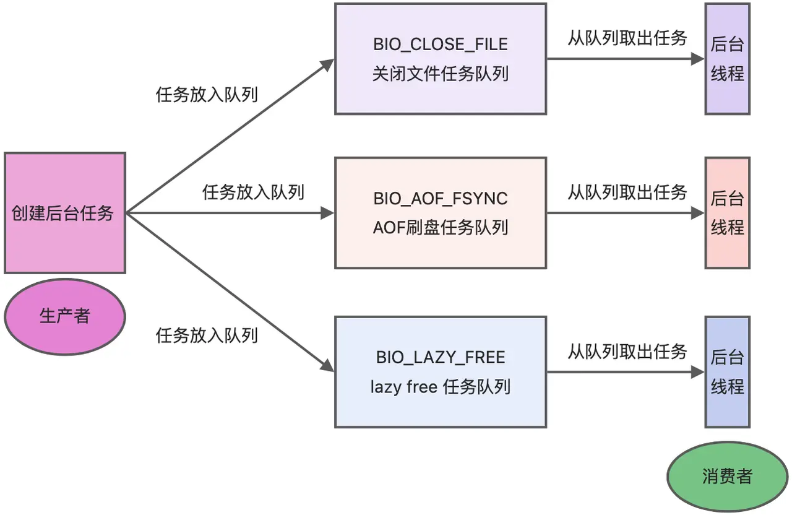

# 线程模型
Redis 最开始从接收到执行到发送命令都是单线程的，在 Redis 6.0 后，引入了多线程负责网络 I/O，但是执行命令依然是单线程负责。而 Redis 后台线程，在 Redis 2.6 前，有 2 个线程负责关闭文件、AOF 刷盘，在 Redis 4.0 后，又引入了1条后台线程负责释放内存，后台线程专门负责处理耗时任务，防止阻塞主线程。

## Redis线程
主线程：单线程，主要负责执行命令

后台线程（Redis 4.0 后）：3 个线程，负责异步处理关闭文件、AOF 刷盘、释放内存

I/O线程（Redis 6.0 后）：3 个线程，负责网络 I/O

## 流程


### 接收命令(单线程)
I/O 单线程负责，使用`I/O多路复用`，I/O 单线程处理多个 I/O 流，即 select/epoll 机制。在 Redis 只运行单线程的情况下，该机制允许内核中，同时存在多个监听 Socket 和已连接 Socket。内核会一直监听这些 Socket 上的连接请求或数据请求。一旦有请求到达，就会交给 Redis 线程处理，这就实现了一个 Redis 线程处理多个 IO 流的效果。

### 处理命令(单线程)
主线程负责，Redis 处理命令一直采用单线程处理，这也是普遍称 Redis 为单线程的原因。Redis 采用单线程模型，避免多线程带来的系统复杂度、线程切换、死锁造成的性能损耗。

### 发送命令(多线程)
I/O 多线程负责，Redis 6.0 后采用了 I/O 多线程来发送命令，来增加 Redis 网络 I/O 性能。

### 耗时任务(多线程)
后台多线程负责，Redis 4.0 后采用 3 个后台线程来处理关闭文件、AOF 刷盘、释放内存耗时任务。后台线程专门负责处理耗时任务，防止阻塞主线程。后台线程相当于一个消费者，生产者把耗时任务丢到任务队列中，消费者（BIO）不停轮询这个队列，拿出任务就去执行对应的方法即可。



BIO_CLOSE_FILE（关闭文件任务队列）：后台线程调用 close(fd) ，将文件关闭。

BIO_AOF_FSYNC（AOF刷盘任务队列）：后台线程调用 fsync(fd)，将 AOF 文件刷盘。

BIO_LAZY_FREE（lazy free 任务队列）：后台线程调用 free(obj) 释放对象、free(dict) 删除数据库所有对象、free(skiplist) 释放跳表对象。

## Redis为什么快？
单线程的 Redis 吞吐量可以达到 10w/s 的原因：
- Redis 是内存数据库，读写操作都在内存中完成。
- Redis 是键值对数据库，查询时间复杂度为 O(1)。
- Redis 是单线程模型，避免多线程带来的复杂系统、线程切换、死锁造成的性能损耗。
- Redis 采用了 I/O 多路复用机制，实现 I/O 单线程处理多个 IO 流的效果。

## 原子性
Redis 执行一条命令时，是单线程的，具备原子性。而要保证执行 2 条命令的原子性，可以把命令写进 `Lua 脚本` ，Redis 会把 Lua 脚本作为一个整体执行，来保证原子性。或者使用 Redis 事务来保证原子性，但是当 Redis 事务中某操作失败时，由于没有事务回滚机制，就不能保证原子性了。

Redis 中并没有提供回滚机制，虽然 Redis 提供了 DISCARD 命令，但是这个命令只能用来主动放弃事务执行，把暂存的命令队列清空，起不到回滚的效果。下面是 DISCARD 命令用法：
```
#读取 count 的值
127.0.0.1:6379> GET count
"1"
#开启事务
127.0.0.1:6379> MULTI
OK
#发送事务的第一个操作，对count减1
127.0.0.1:6379> DECR count
QUEUED
#执行DISCARD命令，主动放弃事务
127.0.0.1:6379> DISCARD
OK
#再次读取a:stock的值，值没有被修改
127.0.0.1:6379> GET count
"1"
```
