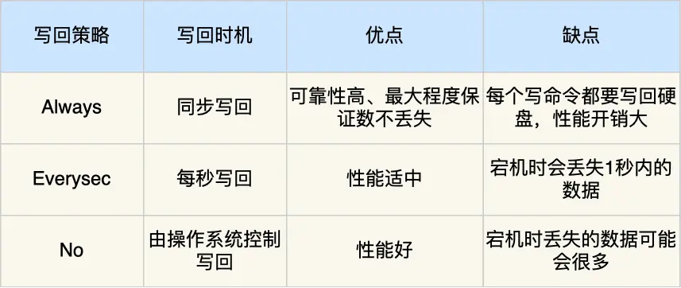
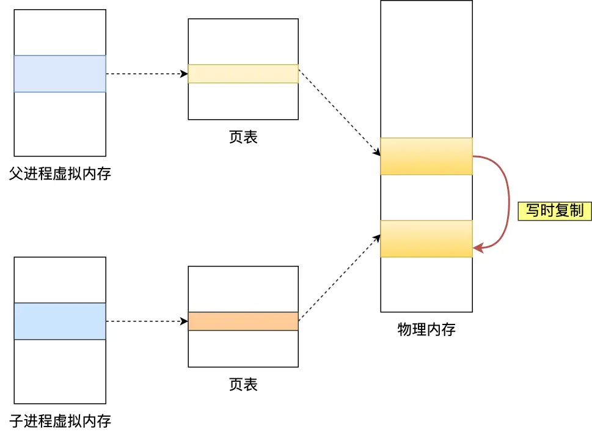

# 持久化

> Redis 的读写操作都是在内存中，所以 Redis 性能才会高，但是当 Redis 重启后，内存中的数据就会丢失，那为了保证内存中的数据不会丢失，Redis 实现了数据持久化的机制，这个机制会把数据存储到磁盘，这样在 Redis 重启就能够从磁盘中恢复原有的数据。

Redis 共有三种数据持久化的方式：
- AOF 日志：每执行一条写操作命令，就把该命令以追加的方式写入到一个文件里。
- RDB 快照：将某一时刻的内存数据，以二进制的方式写入磁盘。
- 混合持久化方式：Redis 4.0 新增的方式，集成了 AOF 和 RBD 的优点。

## AOF日志
### 实现方式
Redis 在执行完一条写操作命令后，把该命令以`追加方式`写入到一个文件里，然后 Redis 重启时，会读取该文件记录的命令，然后逐一执行命令的方式来进行数据恢复。

**为什么先执行命令，再把数据写入日志呢？**

优点：
- 避免额外的检查开销：避免错误语法的命令写入 AOF 日志中。
- 不会阻塞当前写操作：在写操作命令执行成功后才写入 AOF 日志中。

缺点：
- 数据可能会丢失： 在命令写入 AOF 日志前发生宕机。
- 可能阻塞其他操作： 写入 AOF 日志时阻塞后续的操作无法执行。

### 刷盘策略
AOF 日志刷盘过程：
1. Redis 执行完写操作命令后，将命令追加到 server.aof_buf 缓冲区。
2. 通过 write()，将 aof_buf 缓冲区写入内核缓冲区 page cache。
3. 通过 fsync()，将 page cache 的数据写入硬盘。

appendfsync 参数：

### 重写机制
AOF 日志是追加写，保存的是全量的数据，所以当 AOF 文件大小超过设定阈值时，触发重写机制，通过读取最新 Redis 数据，让每条记录只使用一条写命令表达，来压缩 AOF 文件。

AOF日志重写过程：

主进程：
- 执行客户端发来的命令
- 将执行后的写命令追加到 「AOF 重写缓冲区」

子进程（bgrewriteaof）：
1. 扫描Redis数据，转换成1条写命令，覆盖「AOF 缓冲区」
2. 完成日志重写后，发送信号给主进程

主进程（信号处理函数）：
3. 接收子进程信号
4. 将「AOF 缓冲区」数据追加到「AOF 缓冲区」中
5. 刷盘并覆盖原 AOF 文件

## RDB快照
RDB 快照记录某一瞬间的全量数据，RDB 恢复数据的效率比 AOF 高，只需将 RDB 文件读入内存即可，不需要像 AOF 文件需要额外执行操作命令。
### 实现方式
执行 bgsave 命令，创建一个子进程来生成 RDB 快照，避免阻塞主线程。在执行过程中，Redis 依然可以修改数据，被修改的数据会复制一份副本，然后 bgsave 会将副本数据写入 RDB 文件中。

## 混合持久化
- AOF：丢失数据少，但是数据恢复较慢。
- RDB：数据恢复速度快，但是快照的频率不好把握。频率低丢失数据多，频率高影响性能。

为了集成了两者的优点， Redis 4.0 提出了混合使用 AOF 日志和 RDB 快照，也叫混合持久化，既保证了 Redis 重启速度，又降低数据丢失风险。

混合持久化工作在AOF日志重写过程：

主进程：
- 执行客户端发来的命令
- 将执行后的写命令追加到 「AOF 重写缓冲区」

子进程（bgrewriteaof）：
1. ~~扫描 Redis 数据，转换成 1 条写命令，覆盖「AOF 缓冲区」~~  
   将共享数据直接以 RDB 方式覆盖「AOF 缓冲区」
2. 完成日志重写后，发送信号给主进程

主进程（信号处理函数）：
3. 接收子进程信号
4. 将「AOF 缓冲区」数据追加到「AOF 缓冲区」中
5. 刷盘并覆盖原AOF文件

也就是说，使用了混合持久化，AOF 文件：RDB 形式的全量数据 + AOF 形式的增量数据

## Redis大key对持久化影响
持久化影响：
- 当 AOF 刷盘选择 Always 策略时，如果写入大 Key，主线程在执行 fsync() 函数时，阻塞的时间会比较久。其它刷盘策略不会阻塞主线程。
- AOF 重写机制和 RDB 快照，都会通过 fork() 函数创建子进程来处理任务：
    - 创建子进程时，要复制父进程的页表，页表越大，阻塞时间越长；
    - 创建完子进程后，如果父进程修改共享数据，大 Key 占用的物理内存越大，拷贝副本时间越久，阻塞时间越长。
      其它影响：
- 阻塞主线程：如果使用 del 删除大 key，会阻塞主线程。
- 客户端超时阻塞：Redis 主线程阻塞，从客户端视角看，就是很久都没有响应。
- 引发网络阻塞：每次获取大 key 产生的网络流量较大，造成网络阻塞。
- 内存分布不均：集群模型在 slot 分片均匀情况下，会出现数据和查询倾斜情况，部分有大 key 的 Redis 节点占用内存多。

**如何避免大 Key 呢？**
- 在设计时，将大 key 拆分成小 key。
- 定期删除大 key，使用 unlink 命令而非 DEL 命令。
