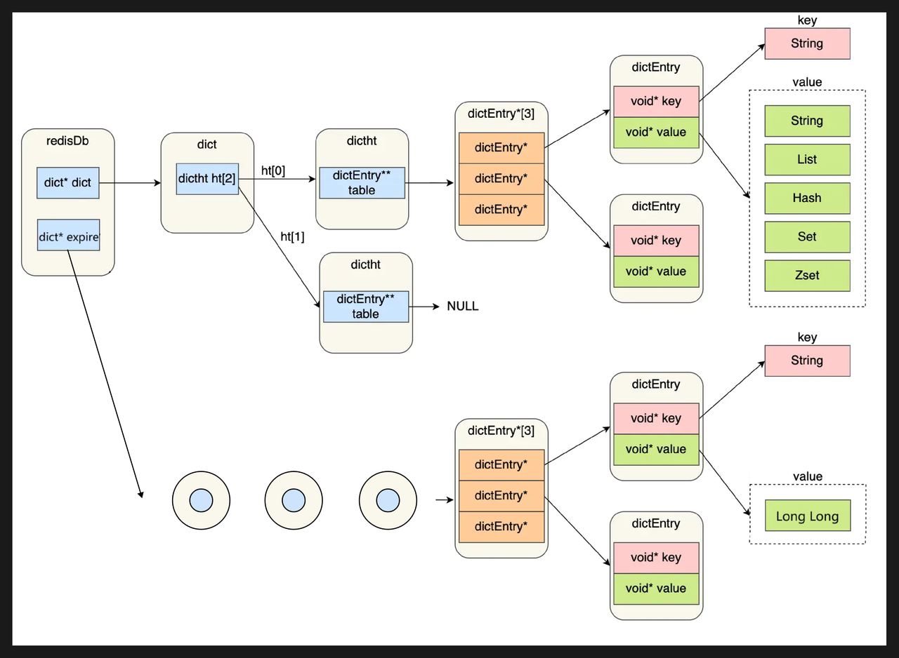

# 删除策略

## 过期删除策略
> Redis 是可以对 key 设置过期时间的，因此需要有相应的机制将已过期的键值对删除，而做这个工作的就是过期键值删除策略。

### 过期时间
```
-- 设置过期时间
set <key> <value>
expire <key> <n>
-- 设置过期时间
setex <key> <value> <n>
-- 取消过期时间
persist <key>
-- 查看存活时间
ttl <key>
```

### 过期字典
> 过期字典中保存了所有key的过期时间。



当查询一个key时，Redis首先在过期字典中查找key是否存在：
- 如果不在，则查找dict哈希表获取键值。
- 如果存在，则获取该key的过期时间，与当前系统时间比对，判断该key是否过期。

### 删除策略
过期的键值对，就需要通过过期策略进行删除。常见过期策略如下：
- 定时删除(创建定时事件，由事件处理器自动执行key的删除操作)
- 惰性删除(不主动删除过期键，从数据库访问key时，再检查是否过期)
- 定期删除(每隔一段时间随机从数据库中取出一定数量的key检查，删除其中过期键)

Redis 选择「惰性删除+定期删除」这两种策略配合使用，以求在 CPU 时间和避免内存浪费之间取得平衡。

**实现方式**
- 定时删除（定时事件）
- 惰性删除（expireIfNeeded 函数）
- 定期删除（activeExpireCycle 函数）

## 内存淘汰策略
> 过期删除策略是删除已过期的 key，而当 Redis 的运行内存超过 Redis 设置的最大内存后，就会采用内存淘汰策略，删除符合条件的 key，以此来保障 Redis 的高效运行。

### 最大内存
在 redis.conf 配置文件中，可以通过参数 maxmemory <bytes> 来设定最大运行内存。

### 淘汰策略
Redis 内存淘汰策略共有 8 种，大体可以分为两类「不进行数据淘汰」和「进行数据淘汰」
- 不进行数据淘汰的策略
    - noevition（Redis 3.0 后默认）：当 Redis 运行内存超过设置的最大内存后，不淘汰任何数据，当有新数据写入时，会报错通知禁止写入。
- 进行数据淘汰的策略
    - 在设置了过期时间的数据中进行淘汰：
        - volatile-random：随机淘汰设置了过期时间的任意键值；
        - volatile-ttl：优先淘汰更早过期的键值。
        - volatile-lru（Redis3.0 前默认）：淘汰所有设置了过期时间的键值中，最久未使用的键值(最近最少使用)
        - volatile-lfu（Redis 4.0 后新增）：淘汰所有设置了过期时间的键值中，最少使用的键值(最不经常使用)
    - 在所有数据范围内进行淘汰：
        - allkeys-random：随机淘汰任意键值;
        - allkeys-lru：淘汰整个键值中最久未使用的键值；
        - allkeys-lfu（Redis 4.0 后新增）：淘汰整个键值中最少使用的键值。

**查看淘汰策略**
```
> config get maxmemory-policy
1) "maxmemory-policy"
2) "noeviction"
```

**修改淘汰策略**

1.命令配置
```
> config set maxmemory-policy <policy>
```
2.配置文件  
设置 Redis 配置文件中的 maxmemory-policy 参数

**LRU和LFU算法**

LRU（Least Recently Used）：最近最少使用，根据数据访问时间来淘汰

LFU（Least Frequently Used）：最近最不常用，根据数据访问频率来淘汰

**实现方式**

LRU 算法：为 Redis 对象添加访问时间戳，随机采样淘汰（避免链表空间和移动消耗）

LFU 算法：为 Redis 对象添加访问时间戳和频次，根据频率来淘汰数据


