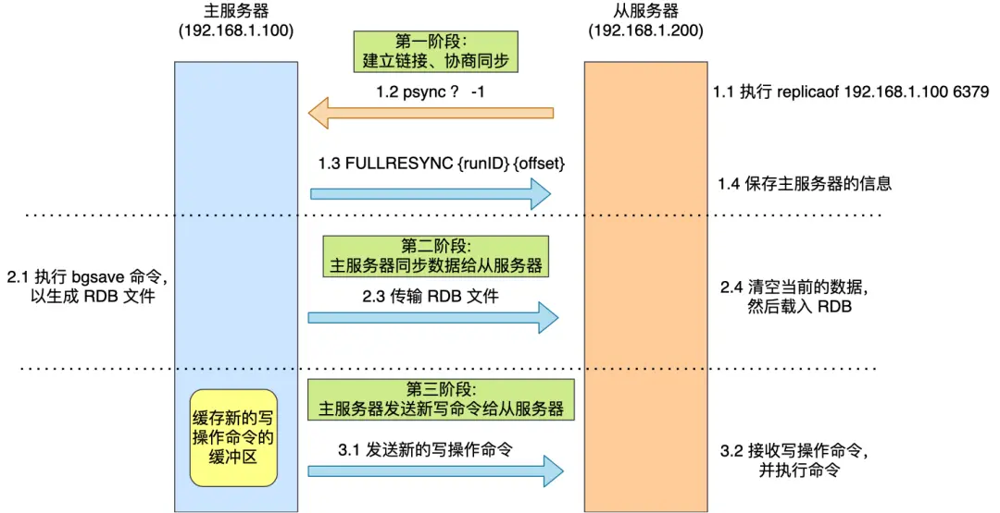
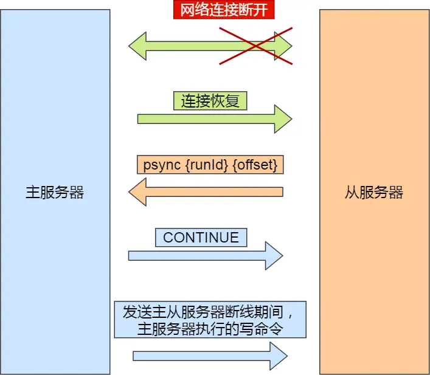
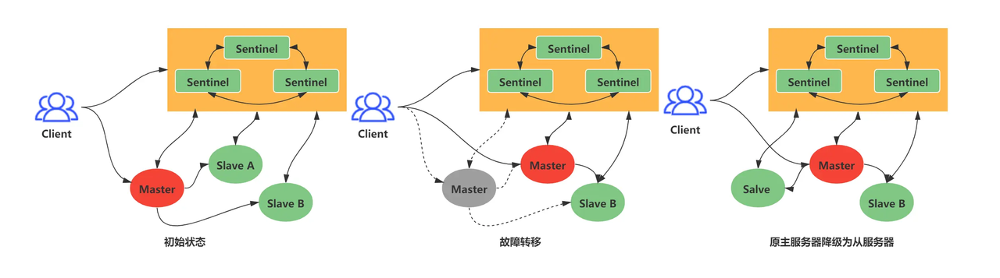
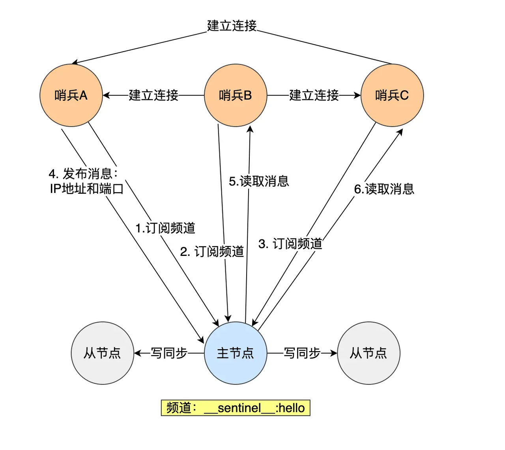
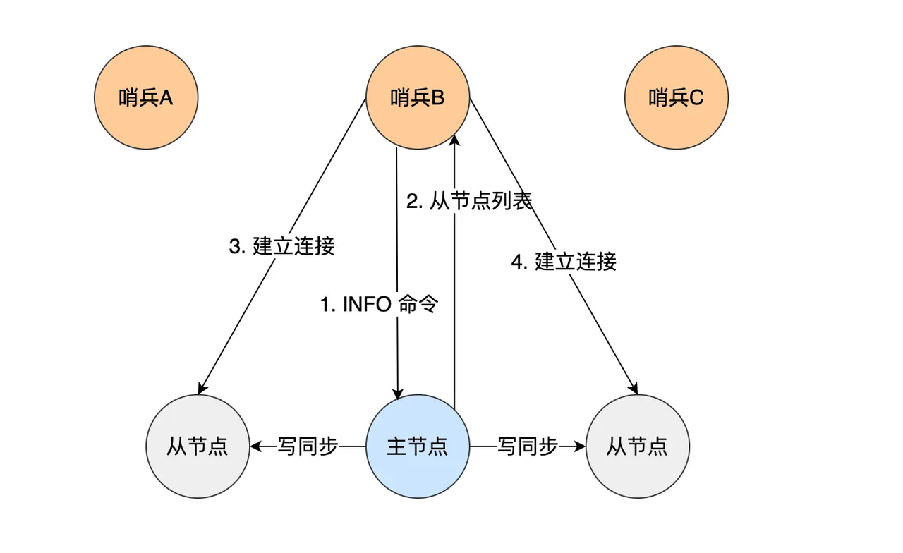
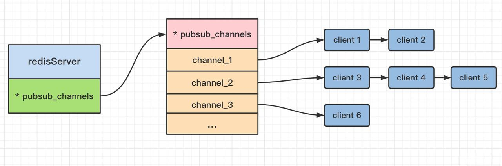

# 集群

>为保证 Redis 服务的高可用性，避免单点故障，可采用 Redis 集群模式，即一主多从，且读写分离。从服务器只负责读数据，主服务器只负责写数据并通过 RDB 快照同步给从服务器，确保主从一致。

## 主从模式(Master-Slave)
### 主从复制
#### 全量复制

主从复制过程可以分为三个阶段：



1. 建立链接，协商同步
   1. 从服务器执行 replicaof 命令，指定主服务器
   2. 从服务器发送 psync 命令（runID（主服务器ID：？）、offset（复制进度：-1））
   3. 主服务器发送 FULLRESYNC 命令，响应并进行全量复制
2. 主服务器同步全量数据给从服务器
   1. 主服务器执行 bgsave 命令，生成 RDB 文件（异步）
   2. 主服务器发送 RDB 文件（异步）
   3. 从服务器接收并加载 RDB 文件（异步）
3. 主服务器同步增量数据给从服务器
   1. 主服务器发送 replication buffer 数据
   2. 从服务接收并执行 replication buffer 数据

注：因为第二阶段都是异步进行，所以主服务器的主线程可能会有新的写命令执行，所以在第二阶段的三步进行过程中，主服务器会将增量数据以 AOF 形式写入 replication buffer 中，在从服务器加载完 RDB 数据后，再发送给从服务器加载，保证主从一致。

#### 命令传播
主从复制建立的连接是 TCP 长连接，目的是避免频繁的 TCP 连接和断开带来的性能开销，后续主服务器可以通过这个连接继续将写操作命令传播给服务器，这个过程称为`基于长连接的命令传播`。

#### 增量复制
如果主服务器与从服务器的连接因网络波动而断开，网络恢复后，主从服务器采用增量复制的方式继续同步。



1. 建立链接，协商同步
   1. ~~从服务器执行 replicaof 命令，指定主服务器~~
   2. 从服务器发送 psync 命令（runID（主服务器ID：~~？~~）、offset（复制进度：~~-1~~））
   3. 主服务器发送 ~~FULLRESYNC~~ <span style="color: #808080;">CONTINUE</span> 命令，响应并进行~~全量复制~~ <span style="color: #808080;">增量复制</span>
2. 主服务器同步增量数据给从服务器
   1. <span style="color: #808080;">主服务器将 repl_backlog_buffer 差异数据写入 replication buffer 中</span>
   2. 主服务器发送 replication buffer 数据
   3. 从服务接收并执行 replication buffer 数据

注：在主服务器进行命令传播时，不仅会将写命令发送给从服务器，还会将写命令写入到 repl_backlog_buffer 环形缓冲区里，因此这个缓冲区里会保存着最近传播的写命令。

主服务器会将自己的 offset 和从服务器发来的 offset 进行比较：
- 如果要读取的数据在 repl_backlog_buffer 里，采用增量同步
- 如果要读取的数据不在 repl_backlog_buffer 里，采用全量同步

#### 服务代理
从服务器也可以作为主服务器的代理，向其它从服务器同步数据。

#### 相关问题
1.如何判断 Redis 节点是否正常工作？  
答：通过`心跳机制`：
- Redis 主节点：每隔 10 秒 ping 从节点，判断从节点是否宕机。
- Redis 从节点：每隔 1 秒发送 replconf ack {offset} 命令，目的是：
    - 实时监测主从节点网络状态。
    - 携带偏移量，检查复制数据是否丢失，若丢失从复制缓冲区中拉取数据。

2.从节点如何删除过期 key？  
答：主节点通过过期删除策略删除过期 key 时，会模拟一条 del 命令，发送给从节点。

### 主从切换
当主服务器发生故障时，一个从服务器被选举为新的主服务器，以实现高可用性和故障恢复的目的。

#### 哨兵模式
哨兵（Sentinel）是负责专门观察主从节点的一个特殊节点，哨兵机制的作用是实现主从节点故障转移，监测主节点是否存活，如果发现主节点挂了，会选举一个从节点切换为主节点，并把新主节点的相关信息通知给从节点和客户端。
##### 监控
哨兵通过心跳机制监测主从节点，每秒 ping 主从节点，看是否收到响应回复。若在规定时间内未收到回复，哨兵则标记这个主从节点为「主观下线」。针对主节点可能因为系统压力大或网络拥塞导致未响应，因此需要部署 3 个及以上的哨兵集群共同决策，若一半以上的哨兵标记该主节点为「主观下线」，则该主节点最终被标记为「客观下线」。
##### 选主&通知
发起标识主节点「客观下线」投票的哨兵成为执行主从切换的候选者，并再次发起请求成为 leader 的投票，若一半以上的哨兵赞同，则该候选者成为 leader，执行主从切换。

由leader执行主从切换：



1. 选举新主节点
   1. 选举新主节点
      1. 过滤网络状态不好的从节点
      2. 比较从节点的优先级（越小越优先）
      3. 优先级一样，比较从节点复制进度（越大越优先）
      4. 复制进度一样，比较从节点ID（越小越优先）
   2. 升级为主节点
      1. 哨兵 leader 向被选中的从节点发送 SLAVEOF no one 命令
      2. 从节点接收命令升级为新的主节点
      3. 哨兵 leader 每秒发送 INFO 命令，并观察命令回复中角色信息，从 slave 变为 master 时，哨兵 leader 知道从节点已成功升级为主节点
2. 将从节点指向新主节点
   1. 哨兵 leader 向所有从节点发送 SLAVEOF <新主节点IP> <新主节点PORT>
   2. 从节点接收命令指向新主节点
3. 通知客户主节点已更换
   1. 哨兵 leader 通过 Redis 的发布者/订阅者机制向客户端推送频道消息，如主从切换完成后哨兵就会向 +switch-master 频道发布新主节点的 IP 和 PORT 信息
   2. 客户端接收到信息，向新主节点进行通信
4. 将旧主节点变为从节点
   1. 哨兵集群继续监视旧主节点
   2. 当旧主节点上线时，哨兵集群向其发送 SLAVEOF <新主节点IP> <新主节点PORT> 命令
   3. 旧主节点接收命令变为从节点，并指向新主节点

#### 集群脑裂
由于网络问题，主从节点失联，但客户端依然可以正常更新主节点数据；哨兵监控主节点客观下线后，重新选举出新主节点。网络恢复后，旧主节点降级为从节点，再与新主节点进行同步复制的时候，会清空自己的缓冲区，导致之前客户端写入的数据丢失。

##### 解决方案
当主节点发现从节点下线或者通信超时的总数量小于阈值时，那么禁止主节点进行写数据，直接把错误返回给客户端。

在 Redis 的配置文件中有两个参数我们可以设置：
- min-slaves-to-write x，主节点必须要有至少 x 个从节点连接，如果小于这个数，主节点会禁止写数据。
- min-slaves-max-lag x，主从数据复制和同步的延迟不能超过 x 秒，如果超过，主节点会禁止写数据。

#### 哨兵集群
```
-- 搭建哨兵集群
sentinel monitor <master-name> <master-ip> <redis-port> <quorum>
```
##### 发现方式
哨兵节点之间通过 Redis 的`发布者/订阅者机制`来相互发现。

在主从集群中，主节点上有__sentinel__:hello 频道，不同哨兵就是通过它来相互发现，实现互相通信。

在下图中，哨兵 A 把自己的 IP 地址和端口的信息发布到__sentinel__:hello 频道上，哨兵 B 和 C 订阅了该频道。那么此时，哨兵 B 和 C 就可以从这个频道直接获取哨兵 A 的 IP 地址和端口号。然后，哨兵 B、C 可以和哨兵 A 建立网络连接。



##### 监控从节点
主节点知道所有「从节点」的信息，所以哨兵会每 10 秒一次的频率向主节点发送 INFO 命令来获取所有「从节点」的信息。

如下图所示，哨兵 B 给主节点发送 INFO 命令，主节点接受到这个命令后，就会把从节点列表返回给哨兵。接着，哨兵就可以根据从节点列表中的连接信息，和每个从节点建立连接，并在这个连接上持续地对从节点进行监控。哨兵 A 和 C 可以通过相同的方法和从节点建立连接。



正是通过 Redis 的发布者/订阅者机制，哨兵之间可以相互感知，然后组成集群，同时，哨兵又通过 INFO 命令，在主节点里获得了所有从节点连接信息，于是就能和从节点建立连接，并进行监控了。

##### 发布/订阅机制

- 频道订阅：订阅频道时先检查字段内部是否存在；不存在则为当前频道创建一个字典且创建一个链表存储客户端id；否则直接将客户端id插入到链表中。
- 取消频道订阅：取消时将客户端 id 从对应的链表中删除；如果删除之后链表已经是空链表了，则将会把这个频道从字典中删除。
- 发布：首先根据 channel 定位到字典的键， 然后将信息发送给字典值链表中的所有客户端

Redis 发布/订阅机制为什么不可以作为消息队列？

Redis 的发布/订阅机制，* pubsub_channels 哈希表中存储的键是频道，值是客户端的串联的链表。发布消息时，在哈希表中查找该频道的键，再将消息直接发送给字典值中所有的客户端。所以 Redis 的发布/订阅机制，消息是没有载体的，不会保存或持久化，只适合即时通讯，不满足消息队列的消息可靠性的条件。

## 集群模式(Cluster)
> 主从模式，是一个 Redis 实例中一主多从，主从复制相同数据，同步备份保证高可靠性。而集群模式，是多个 Redis 实例中每个实例都保存一个大数据的部分数据，负载均衡保证高性能。
### 切片集群
Redis Cluster 方案采用哈希槽（Hash Slot），来处理数据和节点间的映射关系。在 Redis Cluster 方案中，一个切片集群共有 16284 个哈希槽，将 key 按照 CRC16 算法得到的哈希值对哈希槽数量取模，映射到对应编号的哈希槽中。而哈希槽默认平均分配到每个 Redis 实例的主节点上。


