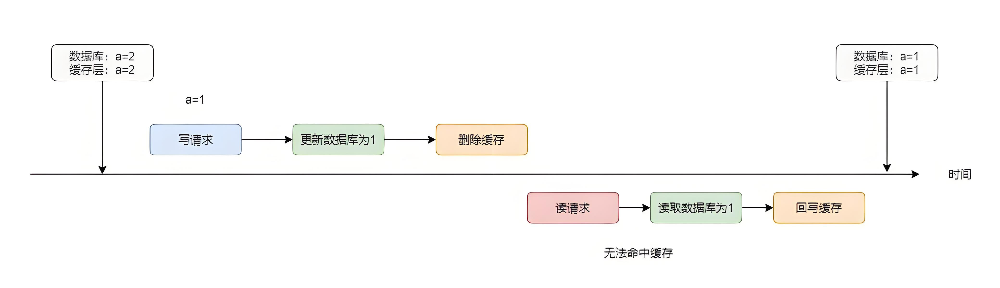
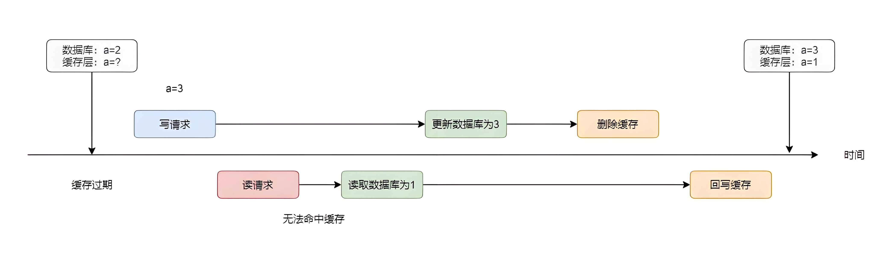
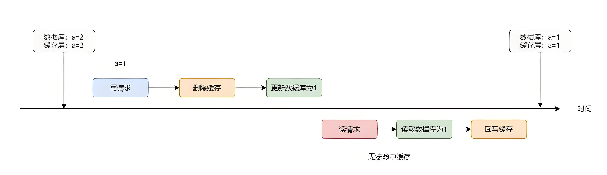
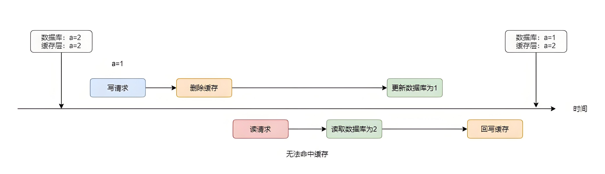
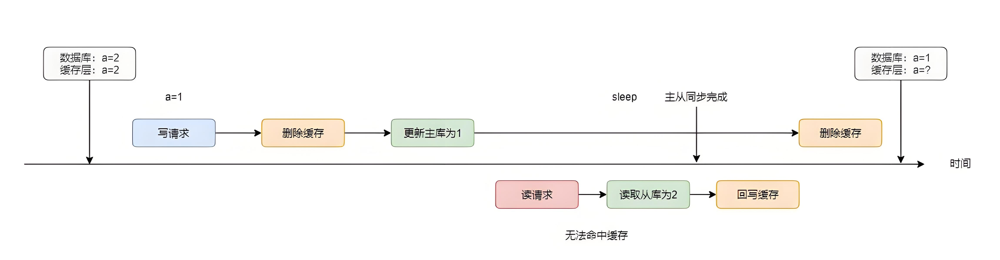
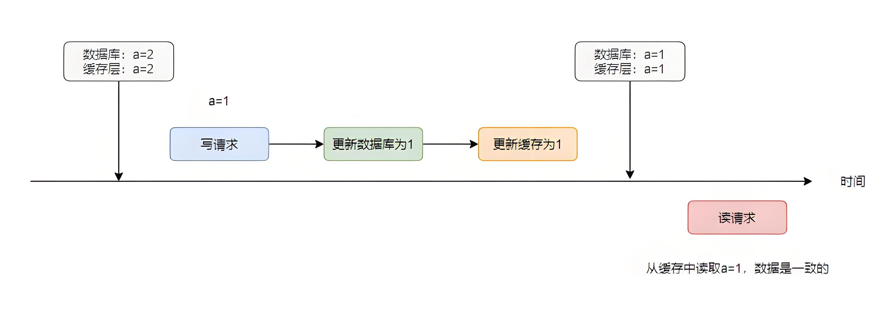
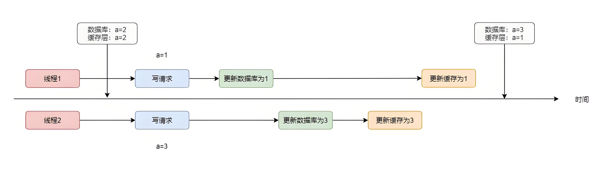
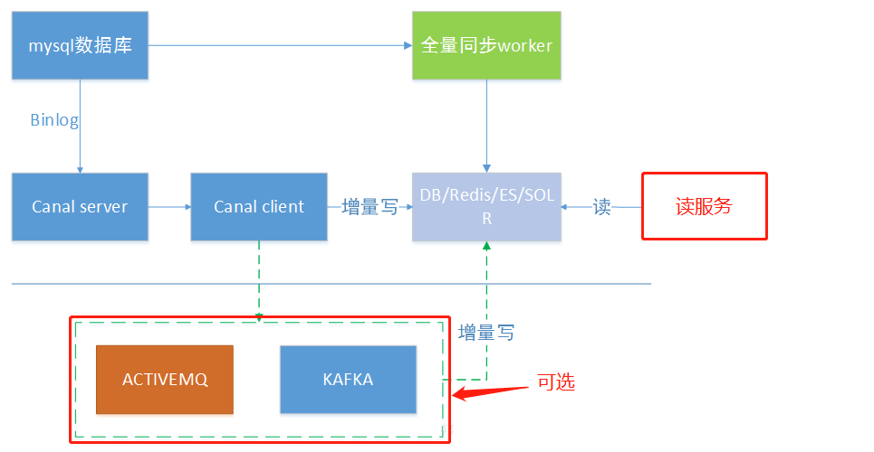
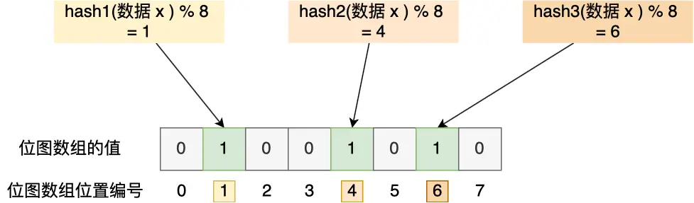

# 缓存设计

> 用户的数据一般都存储在数据库，数据库的数据都存储在磁盘，而磁盘 I/O 又非常慢，所以当大量请求同时访问数据库时，可能会导致数据库的崩溃。因此，一般把内存数据库 Redis 作为 MySQL 数据库的缓存，在 Redis 中缓存 MySQL 数据库中的数据，用户不直接访问 MySQL 而是访问 Redis ，这样的话操作既高效又最大程度上避免了数据库崩溃。

## 数据库和缓存一致性
### 方案
- 先更新数据库，再删除缓存（极低概率读写并发时出现数据不一致 + 懒加载）（读快于写）




- 先删除缓存，再更新数据库（较低概率读写并发时出现数据不一致 + 懒加载）





- 先更新数据库，再更新缓存（较低概率写写并发时出现数据不一致）
- 先更新缓存，再更新数据库（较低概率写写并发时出现数据不一致）




### 升级
- 先更新数据库，再删除缓存（Cache Aside 策略）（优选)
- 先删除缓存，再更新数据库（+延时双删）（睡眠时间不好判断）（次选）
- 先更新数据库，再更新缓存（+分布式锁/过期时间）（影响性能）
- 先更新缓存，在更新数据库（+分布式锁/过期时间）（影响性能）

### 问题
优选先更新数据库，再删除缓存的方案，但是由于该方案有两步操作，如果更新数据库成功，但是删除缓存失败，也会造成数据不一致，因此需要确保第二步操作也必须成功。
- 消息队列+重试缓存的删除
    - 优点：保证缓存一致性的问题
    - 缺点：对业务代码入侵
- 订阅 MySQL binlog + 消息队列 + 重试缓存的删除
    - 优点：保证缓存一致性的问题，也规避了代码入侵问题
    - 缺点：引入的组件较多，运维要求高



Alibaba 开源的 Canal 中间件模拟 MySQL 主从复制的交互协议，伪装成 MySQL 的一个从节点，向 MySQL 主节点发送 dump 请求，主节点收到请求推送 Binlog 给 canal：
1. 通过 EventPaser 解析数据
2. 通过 EventSink 过滤归并数据
3. 通过 EventStore 存储数据（内存循环写）
4. 将数据传输给 Canal 客户端

## 缓存异常
### 缓存雪崩
> 为了保证缓存与数据库中的数据一致，会给 Redis 中的数据设置过期时间，当大量缓存数据在同一时间过期或 Redis 故障宕机时，如果此时有大量用户请求，会直接访问数据库，严重的会造成数据库宕机，从而形成一系列连锁反应，造成整个系统崩溃，这就是缓存雪崩问题。

**产生原因**
- 大量数据同时过期
- Redis 故障宕机

**解决方案**
- 大量数据同时过期
    - 随机过期时间
- Redis 故障宕机
    - 构建 Redis 缓存高可靠集群
    - 服务熔断或请求限流机制
    - 多级缓存

### 缓存击穿
> 某一个热点缓存数据过期，对该数据的大量访问请求直接访问数据库，数据库很容易被高并发击穿，这就是缓存击穿问题。

**产生原因**
- 热点数据过期

**解决方案**
- 逻辑过期（不设置过期时间，value 中加逻辑过期字段，访问时判断，调用子进程）
- 构建缓存分布式锁

### 缓存穿透
> 用户访问的数据既不在缓存中，也不在数据库中，每次访问该数据都要访问数据库，又无法构建缓存，当有大量这样的请求到来时，数据库的压力骤增，这就是缓存穿透问题。

**产生原因**
- 数据误删除
- 黑客恶意攻击

**解决方案**
- 缓存空值或默认值
- 限制非法请求
- 布隆过滤器

布隆过滤器由「初始值都为 0 的位图数组」和「 N 个哈希函数」两部分组成。当我们在写入数据库数据时，在布隆过滤器里做个标记，这样下次查询数据是否在数据库时，只需要查询布隆过滤器，如果查询到数据没有被标记，说明不在数据库中。

布隆过滤器会通过 3 个操作完成标记：

第一步，使用 N 个哈希函数分别对数据做哈希计算，得到 N 个哈希值；

第二步，将第一步得到的 N 个哈希值对位图数组的长度取模，得到每个哈希值在位图数组的对应位置。

第三步，将每个哈希值在位图数组的对应位置的值设置为 1；


```
@Configuration
public class BloomFilterConfig {

    private static int size = 1000000;//预计要插入多少数据

    private static double fpp = 0.05;//期望的误判率

    @Bean
    public BloomFilter<String> bloomFilter() {
        return BloomFilter.create(
                Funnels.stringFunnel(Charset.defaultCharset()),
                //Funnel是一个接口，用于将任意类型的对象转换为字节流
                size, 
                fpp
        );
    }
}
```


