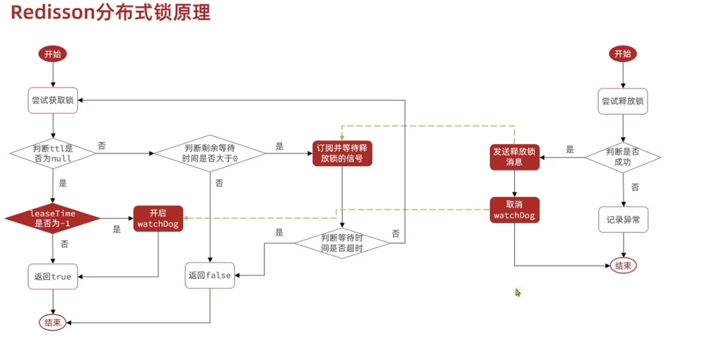

# Redis实战

## 常用命令
### Redis切换数据库
Redis 默认支持 16 个数据库，可以通过 Redis 的配置文件 redis.conf 中的 databases <n> 来修改，客户端与 Redis 建立连接后会默认选择 0 号数据库，可以使用 SELECT 命令切换数据库。
```
-- Redis命令行
redis>SELECT 1
-- Java
jedis.selcet(1)
```
### Redis通用命令
```
-- 查找所有key
>keys *
-- 查找以st1结尾的所有key
>keys *st1
-- 判断key是否存在
>exists list1
-- 判断key的类型
>type list1
-- 删除key
>del key
```
### Redis的DEL/UNLINK命令
**DEL**
- **功能**：DEL 是一个同步操作，它会立即删除给定的一个或多个键及其关联的数据。如果这些键不存在，则不会执行任何操作。
- **性能影响**：对于大型数据结构（如大的列表、哈希表、集合等），DEL 可能会导致阻塞，因为它会在删除之前遍历整个数据结构以释放内存。
- **使用场景**：当你需要确保某个键被立即删除并且不在乎可能的性能开销时，可以使用 DEL。

**UNLINK**
- **功能**：UNLINK 是异步操作，它同样用于删除键，但它会立即将键从数据库索引中移除，而将实际的数据清理工作交给后台线程完成。
- **性能影响**：由于 UNLINK 将大部分工作移到了后台，所以即使对于非常大的键，也不会造成明显的延迟或阻塞。
- **使用场景**：当你要删除一个大键但又不希望阻塞 Redis 服务器时，UNLINK 是更好的选择。

## 分布式锁
### Redis实现分布式锁的优点
- **性能高效**：这是选择缓存实现分布式锁最核心的出发点。
- **实现方便**：Redis 提供了 setnx 方法，实现分布式锁方便。
- **避免单点故障**：因为 Redis 是跨集群部署的，避免了单点故障。

### Redis实现分布式锁的缺点
- **超时时间不好设置**：如果锁的超时时间设置过长，会影响性能，如果设置的超时时间过短会保护不到共享资源。
    - **锁续约**：先给锁设置一个超时时间，然后启动一个守护线程，判断锁的情况，当锁快失效的时候，进行续约。
- **分布式锁不可靠**：Redis 主从复制是异步进行的，导致分布式锁不可靠。如果在 Redis 主节点获取到锁后，在没有同步到其他节点时宕机了，选举的新主节点依然可以获取锁。
    - **红锁**：基于多个主节点的红锁来保证集群环境下分布式锁的可靠性。

### RedLock红锁
**RedLock介绍**

为了保证集群环境下分布式锁的可靠性，Redis 官方设计了一个分布式锁算法 Redlock 红锁，它是基于多个 Redis 主节点的分布式锁(官方推荐是至少部署 5 个)，即使有某个节点发生了故障，锁的数据在其他节点上也有保存，客户端还是可以完成锁操作。

**RedLock算法**

让客户端和多个独立的 Redis 节点依次请求申请加锁，如果客户端能够和一半以上的节点成功地完成加锁操作，那么就认为客户端成功地获得分布式锁，否则加锁失败。

**加锁过程**
1. 客户端获取当前时间。
2. 客户端按顺序依次向 N 个 Redis 节点执行加锁操作：
- 加锁操作使用 SET 命令，带上 NX，EX/PX 选项，以及带上客户端的唯一标识。
- 如果某个 Redis 节点发生故障了，为了保证在这种情况下，Redlock 算法能够继续运行，我们需要给「加锁操作」设置一个超时时间，加锁操作的超时时间需要远远地小于锁的过期时间，一般也就是设置为几十毫秒。
3. 一旦客户端从超过一半的 Redis 节点成功的获取到了锁，就再次获取当前时间，然后计算加锁过程总耗时有没有超过锁的过期时间，没超过则认为客户端加锁成功，否则加锁失败。
4. 加锁成功，重新计算锁的有效时间（锁过期时间-加锁总耗时）；加锁失败，客户端向所有节点发起释放锁的操作。

**成功条件**
- 客户端从超过一半的 Redis 节点成功的获取到了锁
- 加锁过程总耗时没有超过锁的过期时间

### Redisson
> Redisson 是一个在 Redis 的基础上实现的 Java 驻内存数据网格（In-Memory Data Grid）。它不仅提供了一系列的分布式的 Java 常用对象，还提供了许多分布式服务。其中包括（BitSet, Set, Multimap, SortedSet, Map, List, Queue, BlockingQueue, Deque, BlockingDeque, Semaphore, Lock, AtomicLong, CountDownLatch, Publish / Subscribe, Bloom filter, Remote service, Spring cache, Executor service, Live Object service, Scheduler service) Redisson 提供了使用 Redis 的最简单和最便捷的方法。Redisson 的宗旨是促进使用者对 Redis 的关注分离（Separation of Concern），从而让使用者能够将精力更集中地放在处理业务逻辑上。
https://blog.csdn.net/qq_45637260/article/details/126099398

#### Redisson、Jedis、Lettuce区别？
Redisson 是更高层的抽象，Jedis 和 Lettuce 是 Redis 命令的封装。
- Jedis 是 Redis 官方推出的用于通过 Java 连接 Redis 客户端的一个工具包，提供了 Redis 的各种命令支持。
- Lettuce 是一种可扩展的线程安全的 Redis 客户端，通讯框架基于 Netty，支持高级的 Redis 特性，比如哨兵，集群，管道，自动重新连接和 Redis 数据模型。Spring Boot 2.x 开始 Lettuce 已取代 Jedis 成为首选 Redis 的客户端。
- Redisson 是架设在 Redis 基础上，通讯基于 Netty 的综合的、新型的中间件，企业级开发中使用 Redis 的最佳范本

Jedis 把 Redis 命令封装好，Lettuce 则进一步有了更丰富的 Api，也支持集群等模式。但是两者也都点到为止，只给了你操作 Redis 数据库的脚手架，而 Redisson 则是基于 Redis、Lua 和 Netty 建立起了成熟的分布式解决方案，甚至 redis 官方都推荐的一种工具集。

#### 线程锁、进程锁、分布式锁
- 线程锁：控制同一进程中多个线程访问某个方法或代码块。线程锁只在同一进程中有效，通过共享内存实现。(如Java提供的synchronized、ReentrantLock)
- 进程锁：控制同一操作系统中多个进程访问某个共享资源。进程间无法共享内存，因此无法使用线程锁实现。(如OS提供的文件锁)
- 分布式锁：控制不同操作系统或同一系统的不同主机访问某个临界资源。(如Redis、ZooKeeper实现的分布式锁)

**范围**

分布式锁可替代进程锁、线程锁

#### 分布式锁实现
1.**1.0版本（RedisTemplate 操作 Redis）**
```
// 加锁(setIfAbsent=setnx+px)
public Boolean tryLock(String key, String value, long timeout, TimeUnit unit) {
return redisTemplate.opsForValue().setIfAbsent(key, value, timeout, unit);
}
// 解锁，防止删错别人的锁，以uuid为value校验是否自己的锁
public void unlock(String lockName, String uuid) {
if(uuid.equals(redisTemplate.opsForValue().get(lockName)){
redisTemplate.opsForValue().del(lockName);    
}
}

// 结构
if(tryLock){
// todo
}finally{
unlock;
}
```
1.0 版本中 DEL 操作先校验再删除，两步操作不满足原子性，并发下无法保证线程安全。因此引入了 Lua 脚本，来执行 DEL 操作。

2.**2.0 版本（RedisTemplate 执行 Lua 脚本删除）**
```
-- lockDel.lua文件
if redis.call('get', KEYS[1]) == ARGV[1]
then
-- 执行删除操作
return redis.call('del', KEYS[1])
else
-- 不成功，返回0
return 0
end
```
```
// 解锁脚本
DefaultRedisScript<Object> unlockScript = new DefaultRedisScript();
unlockScript.setScriptSource(new ResourceScriptSource(new ClassPathResource("lockDel.lua")));

// 执行lua脚本解锁
redisTemplate.execute(unlockScript, Collections.singletonList(keyName), value);
```
原子性的问题解决了，但还是会造成线程死锁。当一个线程已经获取该锁且未释放时，该线程其它操作命令又去竞争该锁，造成自己等待自己释放锁的死锁现象。而只有当锁是可重入时，即同一线程允许多次获取同一把锁时，就可以防止线程死锁。实现方式为添加计数器，每次获取锁时 +1，释放锁时 -1，当锁 =0 时，就可以释放整个锁了。

3.**3.0 版本（RedisTemplate 执行 Lua 脚本可重入锁）**
```
-- lock.lua文件
local key = KEYS[1];
local threadId = ARGV[1];
local releaseTime = ARGV[2];

-- lockname不存在
if(redis.call('exists', key) == 0) then
redis.call('hset', key, threadId, '1');
redis.call('expire', key, releaseTime);
return 1;
end;

-- 当前线程已id存在
if(redis.call('hexists', key, threadId) == 1) then
redis.call('hincrby', key, threadId, '1');
redis.call('expire', key, releaseTime);
return 1;
end;
return 0;
```
```
-- unlock.lua文件
local key = KEYS[1];
local threadId = ARGV[1];

-- lockname、threadId不存在
if (redis.call('hexists', key, threadId) == 0) then
return nil;
end;

-- 计数器-1
local count = redis.call('hincrby', key, threadId, -1);

-- 删除lock
if (count == 0) then
redis.call('del', key);
return nil;
end;
```
```
/**
*@description 原生redis实现分布式锁
**/
@Getter
@Setter
public class RedisLock {

    private RedisTemplate redisTemplate;
    private DefaultRedisScript<Long> lockScript;
    private DefaultRedisScript<Object> unlockScript;

    public RedisLock(RedisTemplate redisTemplate) {
        this.redisTemplate = redisTemplate;
        // 加载加锁的脚本
        lockScript = new DefaultRedisScript<>();
        this.lockScript.setScriptSource(new ResourceScriptSource(new ClassPathResource("lock.lua")));
        this.lockScript.setResultType(Long.class);
        // 加载释放锁的脚本
        unlockScript = new DefaultRedisScript<>();
        this.unlockScript.setScriptSource(new ResourceScriptSource(new ClassPathResource("unlock.lua")));
    }

    /**
     * 获取锁
     */
    public String tryLock(String lockName, long releaseTime) {
        // 存入的线程信息的前缀
        String key = UUID.randomUUID().toString();

        // 执行脚本
        Long result = (Long) redisTemplate.execute(
                lockScript,
                Collections.singletonList(lockName),
                key + Thread.currentThread().getId(),
                releaseTime);

        if (result != null && result.intValue() == 1) {
            return key;
        } else {
            return null;
        }
    }

    /**
     * 解锁
     * @param lockName
     * @param key
     */
    public void unlock(String lockName, String key) {
        redisTemplate.execute(unlockScript,
                Collections.singletonList(lockName),
                key + Thread.currentThread().getId()
                );
    }
}
```
至此使用 Redis 已经完成了一把分布式锁了，符合互斥、可重入、防死锁的基本特点。然而 releaseTime 锁释放时间不好把控，最好实现锁续约，自动续约锁释放时间。除此之外还要考虑性能（锁的最大等待时间）、优雅（无效锁申请）、重试（失败重试机制）等等。因此，基于 Redis、Lua、Netty 框架的 Redisson 应运而生。

4.**Redisson 实现分布式锁**
```
@Resource
private RedissonClient redissonClient;

RLock rLock = redissonClient.getLock(lockName);
try {
boolean isLocked = rLock.tryLock(expireTime, TimeUnit.MILLISECONDS);
if (isLocked) {
// TODO
}
} catch (Exception e) {
rLock.unlock();
}
```
简洁明了，只需要 RLock 即可实现完美的分布式锁。

#### RLock锁
通过查看源码，发现 RLock 锁定义方式和我们 Redis 自定义 Lua 脚本基本一致，而释放锁方式则有不同。
```
-- Redisson的unlockInnerAsync()函数执行Lua脚本部分
-- 不存在key
if (redis.call('hexists', KEYS[1], ARGV[3]) == 0) then
return nil;
end;
-- 计数器 -1
local counter = redis.call('hincrby', KEYS[1], ARGV[3], -1);
if (counter > 0) then
-- 过期时间重设
redis.call('pexpire', KEYS[1], ARGV[2]);
return 0;
else
-- 删除并发布解锁消息
redis.call('del', KEYS[1]);
redis.call('publish', KEYS[2], ARGV[1]);
return 1;
end;
return nil;
```
```
KEYS:
name 锁名称
channelName，用于pubSub发布消息的channel名称

ARGV:
LockPubSub.UNLOCK_MESSAGE，channel发送消息的类别，此处解锁为0
internalLockLeaseTime，watchDog配置的超时时间，默认为30s
lockName 这里的lockName指的是uuid和threadId组合的唯一值
```
RLock 锁释放步骤：
1. 如果该锁不存在则返回 nil；
2. 如果该锁存在则将其线程的 hash key 计数器 -1；
3. 计数器 counter > 0 ，重置下失效时间，返回 0；否则，删除该锁，发布解锁消息 unlockMessage，返回 1；
在 RLock 源代码中可以看出，在 RLock 释放锁时，通过看门狗机制（watchDog）来锁续约，通过 Redis 发布订阅（PubSub）来消息通知。



##### 看门狗机制(watchDog)
当一个线程持有了一把锁，由于并未设置超时时间 leaseTime，Redisson 默认配置了 30S，开启 watchDog 定时任务，每 10s 对该锁进行一次续约，维持 30s 的超时时间，直到任务完成再删除锁。这就是 Redisson 的锁续约，也就是 WatchDog 实现的基本思路。

##### Redis发布/订阅(PubSub)
当锁被其他线程占用时，通过监听锁的释放通知（在其他线程通过 RedissonLock 释放锁时，会通过发布订阅 PubSub 功能发起通知），等待锁被其他线程释放，也是为了避免自旋的一种常用效率手段。

```
/**RedissonLock的加锁方法lock()里的订阅步骤**/
long threadId = Thread.currentThread().getId();
Long ttl = this.tryAcquire(-1L, leaseTime, unit, threadId);
if (ttl != null) {
// 订阅
RFuture<RedissonLockEntry> future = this.subscribe(threadId);
if (interruptibly) {
this.commandExecutor.syncSubscriptionInterrupted(future);
} else {
this.commandExecutor.syncSubscription(future);
}
// 省略
```

#### RedLock锁
Redisson 实现的分布式锁是不适用 Redis 集群的，主从复制只复制数据而不复制锁，因此当加了 Redisson 分布式锁的主节点宕机后，新选举的主节点是没有加锁的，为了保证集群环境下分布式锁的可靠性，需要使用 Reddison 的 Redlock（红锁）。

RedLock 继承 MultiLock 对象，该对象可以将多个 Redis 节点的 RLock 对象关联为一个红锁，对该红锁进行统一的加锁和释放锁管理。即使有节点发生故障，锁变量仍然是存在的，客户端还是可以完成锁操作。让客户端向多个主节点申请加锁，如果客户端能够和一半以上的主节点成功地完成加锁操作并且总耗时没有超过锁的有效时间，那么就认为客户端成功地获得分布式锁，否则加锁失败。

```
@Resource
private RedissonClient redissonClient;

RLock rLock1 = redissonClient.getLock(lockName1);
RLock rLock2 = redissonClient.getLock(lockName2);
RLock rLock3 = redissonClient.getLock(lockName3);
RedissonRedLock redLock = new RedissonRedLock(rLock1,rLock2,rLock3)

try {
boolean isLocked = redLock.tryLock(expireTime, TimeUnit.MILLISECONDS);
if (isLocked) {
// TODO
}
} catch (Exception e) {
redLock.unlock();
}
```
但是如果使用红锁，需要在多个节点上都添加分布式锁，性能影响和运维成本较大，因此在 Redisson 3.16.0 后，红锁已被弃用，可以使用 Redis 提供的原生 Redlock 算法实现。

#### Redis vs ZooKeeper分布式锁
CAP理论：任何一个分布式系统都无法同时满足
- 一致性(Consistency)
- 可用性(Availablility)
- 分区容错性(Partition tolerance)

Redis 是 AP 类型的分布式锁，是为高可用设计的，如果保证强一致性会非常影响性能。

ZooKeeper 是 CP 类型的分布式锁，是为强一致性设计的，性能相对较差。

Redisson 是 Redis 的更高层抽象，而 Curator 是 ZooKeeper 的更高层抽象。
```
/**-------------------------Redisson----------------------------**/
@Resource
private RedissonClient redissonClient;
RLock rLock = redissonClient.getLock(lockName);
try {
boolean isLocked = rLock.tryLock(expireTime, TimeUnit.MILLISECONDS);
if (isLocked) {
// TODO
}
} catch (Exception e) {
rLock.unlock();
}
/**-------------------------Curator----------------------------**/
@Resource
private CuratorFramework curatorframework;
InterProcessMutex Lock = new InterProcessMutex(curatorframework,lockPath);
try {
boolean isLocked = Lock.acquire(expireTime, TimeUnit.MILLISECONDS);
if (isLocked) {
// TODO
}
} catch (Exception e) {
Lock.release();
}
```
对于一致性的处理，分为强一致和最终一致性。强一致，对系统的吞吐量和性能有较大损耗，一般用在金融/银行系统，而最终一致性，是以牺牲短期的数据强一致、提升可用性的方案。 对于大部分分布式系统，强烈建议放弃强一致性，采取最终一致性方案。

## 热key
### 什么是热key
- **QPS 集中在特定的 Key**：Redis 实例的总 QPS 为 10,000，而其中一个 Key 的每秒访问量达到了 4,000。

### 热key产生的原因
- **某个热点数据访问量暴增**：重大的热搜事件、参与秒杀的商品。

### 如何处理热key
- **读写分离**：主节点处理写请求，从节点处理读请求。
- **集群架构**：将热点数据分散存储在多个 Redis 节点上。
- **二级缓存**：hotkey 采用二级缓存的方式进行处理，将 hotkey 存放一份到 JVM 本地内存中（可以用 Caffeine）

### 热key导致的问题
- **占用大量的 CPU 和带宽**：影响 Redis 实例对其他请求的正常处理，甚至可能导致 Redis 宕机。

### 如何找到热key
1.使用 Redis 自带的 `--hotkeys` 参数来查找。
```
redis-cli -p 6379 --hotkeys
```
2.使用 `MONITOR` 命令。

`MONITOR` 命令是 Redis 提供的一种实时查看 Redis 的所有操作的方式，可以用于临时监控 Redis 实例的操作情况，包括读写、删除等操作。  
由于该命令对 Redis 性能的影响比较大，因此禁止长时间开启 `MONITOR`。

3.借助开源项目。

京东零售的 [hotkey](https://gitee.com/jd-platform-opensource/hotkey) 这个项目不光支持 hotkey 的发现，还支持 hotkey 的处理。

## 大key
### 什么是大key
- **Key 本身的数据量过大**：String 类型的 value 超过 1MB。
- **Key 中的成员数过多**：List、Hash、Set 等类型的成员超过 5000 个。
- **Key 中成员的数据量过大**：Hash 等类型的成员只有 2,000 个，但 Value 总大小超过 10MB。

### 大key产生的原因
- **程序设计不当**：直接使用 String 类型存储较大的文件对应的二进制数据。
- **数据规模预计失误**：使用集合类型时没有考虑数据量的快速增长。
- **未及时清理垃圾数据**：哈希中冗余了大量的无用键值对。

### 如何处理大key
- **采用合适的数据结构**：例如，文件二进制数据不使用 String 保存、使用 HyperLogLog 统计页面 UV、Bitmap 保存状态信息（0/1）。
- **分割 bigkey**：将一个 bigkey 分割为多个小 key。例如，将一个含有上万字段数量的 Hash 按照一定策略（比如二次哈希）拆分为多个 Hash。
- **手动清理**：Redis 4.0+ 可以使用 UNLINK 命令来异步删除一个或多个指定的 key。Redis 4.0 以下可以考虑使用 SCAN 命令结合 DEL 命令来分批次删除。
- **开启惰性删除**：lazy-free 特性是 Redis 4.0 开始引入的，指的是让 Redis 采用异步方式延迟释放 key 使用的内存，将该操作交给单独的子线程处理，避免阻塞主线程。

### 大key导致的问题
- **客户端超时阻塞**：由于 Redis 执行命令是单线程处理，然后在操作大 key 时会比较耗时，那么就会阻塞 Redis，从客户端的视角看，就是很久都没有响应。
- **网络阻塞**：每次获取大 key 产生的网络流量较大，如果一个 key 的大小是 1 MB，每秒访问量为 1000，那么每秒会产生 1000MB 的流量，这对于普通千兆网卡的服务器来说是灾难性的。
- **工作线程阻塞**：如果使用 del 删除大 key 时，会阻塞工作线程，这样就没办法处理后续的命令。

### 如何找到大key
1.使用 Redis 自带的 `--bigkeys` 参数来查找。

扫描 Redis 中的所有 key，且只能找出每种数据结构占用内存最大的 String 数据类型，包含元素最多的复合数据类型。
```
-- 参数-i控制每次扫描后休息的时间间隔时间(秒)
redis-cli -p 6379 -- bigkeys -i 3
```
2.使用 Redis 自带的 `SCAN` 命令

`SCAN` 命令可以按照一定的模式和数量返回匹配的 key。获取了 key 之后，可以利用 `STRLEN`、`HLEN`、`LLEN` 等命令返回其长度或成员数量。

3.借助开源工具分析 RDB 文件

redis-rdb-tools：Python 语言  
rdb_bigkeys：Go 语言（性能更好）


## 如何设计秒杀场景以及超卖现象？
1.在数据库层面解决在查询商品库存时加排他锁，执行如下语句：
```
select * from goods for where goods_id=?  for update  
```
在事务中线程 A 通过 select * from goods for where goods_id=#{id} for update 语句给 goods_id为#{id} 的数据行上了锁。那么其他线程此时可以使用 select 语句读取数据，但是如果也使用 select for update 语句加锁，或者使用 update，delete 都会阻塞，直到线程 A 将事务提交（或者回滚），其他线程中的某个线程排在线程 A 后的线程才能获取到锁。

2.更新数据库减库存的时候，进行库存限制条件
```
update goods set stock = stock - 1 where goods_id = ？ and stock > 0
```
这种通过数据库加锁来解决的方案，性能不是很好，在高并发的情况下，还可能存在因为获取不到数据库连接或者因为超时等待而报错。
- 利用分布式锁

同一个锁 key，同一时间只能有一个客户端拿到锁，其他客户端会陷入无限的等待来尝试获取那个锁，只有获取到锁的客户端才能执行下面的业务逻辑。这种方案的缺点是同一个商品在多用户同时下单的情况下，会基于分布式锁串行化处理，导致没法同时处理同一个商品的大量下单的请求。

- 利用分布式锁 + 分段缓存

把数据分成很多个段，每个段是一个单独的锁，所以多个线程过来并发修改数据的时候，可以并发的修改不同段的数据假设场景：假如你现在商品有 100 个库存，在 redis 存放 5 个库存 key，形如:
```
key1=goods-01,value=20;
key2=goods-02,value=20;
key3=goods-03,value=20
```
用户下单时对用户 id 进行 %5 计算，看落在哪个 redis 的 key 上，就去取哪个，这样每次就能够处理 5 个进程请求

这种方案可以解决同一个商品在多用户同时下单的情况，但有个坑需要解决：当某段锁的库存不足，一定要实现自动释放锁然后换下一个分段库存再次尝试加锁处理，此种方案复杂比较高。

- 利用 redis 的 incr、decr 的原子性 + 异步队列

实现思路
1. 在系统初始化时，将商品的库存数量加载到 redis 缓存中
2. 接收到秒杀请求时，在 redis 中进行预减库存（利用 redis decr 的原子性），当 redis 中的库存不足时，直接返回秒杀失败，否则继续进行第 3 步；
3. 将请求放入异步队列中，返回正在排队中；
4. 服务端异步队列将请求出队（哪些请求可以出队，可以根据业务来判定，比如：判断对应用户是否已经秒杀过对应商品，防止重复秒杀），出队成功的请求可以生成秒杀订单，减少数据库库存（在扣减库存的 sql 如下，返回秒杀订单详情）
    ```
   update goods set stock = stock - 1 where goods_id = ? and stock > 0
    ```
5. 用户在客户端申请秒杀请求后，进行轮询，查看是否秒杀成功，秒杀成功则进入秒杀订单详情，否则秒杀失败

这种方案的缺点：由于是通过异步队列写入数据库中，可能存在数据不一致，其次引用多个组件复杂度比较高